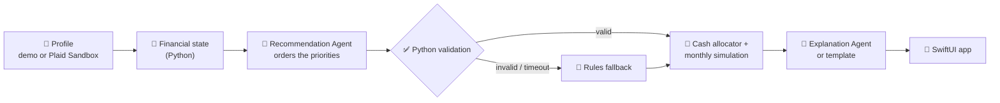

<div align="center">


# Adaptive Retirement

### Target Date Fund 2.0: same retirement date, different financial lives.

**Bounded AI reads a participant's real cash flow, debt and savings. Python turns it into an affordable,<br/>explainable plan for where every next dollar should go.**

   
<br/>
   

**HackUMBC 2026** · University of Maryland, Baltimore County

[The problem](#-the-problem) · [Results](#-the-result-same-age-different-plan) · [How it works](#%EF%B8%8F-how-it-works) · [AI guardrails](#%EF%B8%8F-ai-guardrails) · [Status](#-project-status) · [Run it](#-quick-start)

</div>

---

## 🎯 The problem

> [!IMPORTANT]
> **A target-date fund only knows your birth year.** Two 35-year-olds retiring in 2058 get the *same* plan, even if one has six months of savings and the other carries **$18,000 of credit-card debt at 25% APR**.

T. Rowe Price, whose target-date lineup is its largest product line, has publicly said that personalization is the next step for target-date solutions ([research](https://www.troweprice.com/institutional/us/en/insights/articles/2024/q3/make-it-personal-the-next-chapter-for-target-date-solutions-na.html)). **Adaptive Retirement** is a working prototype of that idea:

<table>
<tr>
<td width="33%" valign="top">

### 💵 Contribute
What retirement contribution **fits this person's cash flow** after essentials and required debt payments?

</td>
<td width="33%" valign="top">

### 🧭 Prioritize
Should the **next dollar** go to the employer match, emergency savings, or high-interest debt?

</td>
<td width="33%" valign="top">

### 📈 Project
What happens to **debt, cash and retirement assets**, month by month, until retirement?

</td>
</tr>
</table>

The target-date allocation itself **stays unchanged**. Only contributions and cash priorities adapt.

---

## 📊 The result: same age, different plan

Jordan and Morgan are both **35** and plan to retire at **67**. The same fund would treat them the same way:

| | 🟢 **Jordan**: financially established | 🟠 **Morgan**: competing priorities |
|---|---|---|
| Salary | $120,000 | $84,000 |
| Emergency savings | **6 months** | **1 month** |
| Debt | $15,000 student loan at 4% | **$18,000 credit card at 25%** |
| **Adaptive plan** | Keep the 10% contribution; surplus to cash | Contribute 5% to keep the full match, **put $963.80/month extra on the card** |

### Morgan: Current habits vs. Adaptive plan

Computed month by month by the deterministic engine (no AI involved in any number):

| Outcome at age 67 | Current | **Adaptive** | Difference |
|---|---:|---:|---:|
| 💳 Credit card paid off | month 135 (~11 years) | **month 16** | **119 months sooner** |
| 🔥 Total card interest paid | $35,788 | **$3,272** | **$32,516 saved** |
| 🏦 Retirement balance | $1,320,893 | **$1,462,562** | **+$141,669** |
| 🏦 Retirement balance (today's dollars) | $599,382 | **$663,668** | **+$64,286** |
| 🛟 Full 3-month emergency fund | month 9 | month 21 | 12 months later |

> [!NOTE]
> **The tradeoff is shown, not hidden.** Paying the 25% card first means Morgan builds the full emergency fund a year later. The app puts retirement, debt and cash side by side, so a slower cash buffer is visible next to the $32,516 of interest it saves.

---

## ⚙️ How it works



| Step | Who | What happens |
|:---:|---|---|
| **1** | 🧮 Python | Computes take-home cost of contributions, the allocatable budget, emergency months, match capture and high-interest debt |
| **2** | 🤖 Recommendation Agent | Orders three priorities (starter reserve, high-APR debt, full reserve) and cites evidence for each |
| **3** | ✅ Python | Rejects invalid orders, unknown evidence or numeric claims, and falls back to the rules order |
| **4** | 📐 Python | Funds every dollar through the waterfall and simulates debt, cash and retirement monthly |
| **5** | 💬 Explanation Agent | Writes a plain-language "why this plan" with no numbers; the app shows exact amounts separately |

<details>
<summary><b>📋 The adaptive waterfall (click to expand)</b></summary>

| Step | Priority | Why it matters |
|:---:|---|---|
| **0** | Essentials and required debt minimums | Nothing discretionary is recommended if basics aren't covered |
| **1** | Critical reserve: min($1,000, one month) | Avoids raiding the 401(k) for a small emergency |
| **2** | Employer match | Captures the full match when affordable |
| **3–5** | Starter reserve · high-APR debt (≥10%) · full reserve | The only steps the AI may reorder |
| **6** | Retirement saving toward a 15% combined rate | Restores contributions once liquidity and debt are handled |
| **7** | Residual cash | Kept as unassigned surplus |

</details>

---

## 🛡️ AI guardrails

> [!TIP]
> **AI chooses the order. Python computes every dollar.** No trading, no portfolio changes, and no money routed through a language model.

<table>
<tr>
<td width="50%" valign="top">

#### ✅ The AI may
- Order starter reserve, high-APR debt and full reserve
- Cite evidence and name the tradeoff
- Explain the plan and what changed since last time
- Respect an explicit planning preference

</td>
<td width="50%" valign="top">

#### ⛔ The AI may not
- Change essentials, debt minimums or the critical reserve
- Change the match formula, APRs, caps or return assumptions
- Change the investment allocation
- Infer anything from names, age or demographics

</td>
</tr>
</table>

| Safety net | Behavior |
|---|---|
| ⏱️ **4-second budget** | Both AI calls share one deadline, with no retries |
| 🔌 **Circuit breaker** | After repeated timeouts or a rate limit, AI pauses and requests fall back instantly |
| 🏷️ **Honest labels** | Every response says `ai` or `rules_fallback`, with a reason such as `TIMEOUT` or `AI_COOLDOWN` |
| 🔒 **Privacy** | Prompts contain only computed indicators: no names, IDs or account data |

---

## 🚦 Project status

| Area | Status | Owner |
|---|---|---|
| API, contracts, Gemini AI pipeline | ✅ Done | Developer A |
| Financial state, policy, validation | ✅ Done | Developer B |
| Monthly simulation and evaluator | ✅ Done | Developer C |
| Saved AI decisions and offline demo bundle | 🟡 In progress | Developer C (A + B review) |
| SwiftUI iPhone app | 🟡 In progress | Frontend |
| Plaid Sandbox import | ⚪ Stretch goal | Developer A |

**Out of scope by design:** readiness scores, success probabilities, allocation changes based on debt, trading, tax optimization and real bank credentials.

---

## 🚀 Quick start

```bash
cd backend
python -m venv .venv
source .venv/bin/activate          # Windows: .venv\Scripts\activate
pip install -r requirements-test.txt
cp .env.example .env               # optional: add GEMINI_API_KEY for live AI
uvicorn app.main:app --port 8000
```

```bash
python scripts/smoke.py            # checks health, profiles, evaluations and errors
pytest                             # 320 backend tests
```

> [!NOTE]
> **No API key? It still works.** Without `GEMINI_API_KEY`, every response uses the rules fallback and is labeled that way. The phone reaches the laptop through a Cloudflare tunnel; see [`backend/RUNBOOK.md`](backend/RUNBOOK.md).

<details>
<summary><b>🔌 API surface</b></summary>

| Endpoint | Purpose |
|---|---|
| `GET /health` | Status, versions, Plaid flag |
| `GET /v1/demo-profiles` | The three synthetic profiles |
| `POST /v1/evaluate` | Profile + optional scenario → state, plan, decision, explanation, projections |
| `POST /v1/plaid/*` | Stretch goal; returns `503 PLAID_DISABLED` for now |

Money is integer USD cents; rates are decimals (`0.05` = 5%). The full schema is in [`contracts/openapi.json`](contracts/openapi.json), with real example payloads in [`contracts/examples/`](contracts/examples/).

</details>

<details>
<summary><b>🗂️ Repository map</b></summary>

```text
backend/
  app/
    main.py, api.py, schemas.py      API, routes and the shared contract
    ai/                              Gemini client, prompts, pipeline, circuit breaker
    engine/                          state, policy, simulation, evaluator
    engine_port.py                   the one seam between API and engine
  scripts/                           contracts export, smoke test, demo export
  fixtures/                          Jordan, Morgan, Casey (+ Morgan cash-security)
  tests/                             320 tests
contracts/                           OpenAPI + example payloads for iOS
BACKEND.md · FRONTEND.md             full specifications
```

</details>

<details>
<summary><b>🧰 Tech stack</b></summary>

| Layer | Technology |
|---|---|
| iPhone app | Swift, SwiftUI, Swift Charts, iOS 17+ |
| Backend | Python 3.12, FastAPI, Pydantic, Uvicorn |
| Financial engine | Pure Python, `Decimal` cents, deterministic monthly simulation |
| AI | Gemini 3.5 Flash-Lite via `google-genai`, structured output, backend only |
| Hosting | A teammate's laptop + Cloudflare quick tunnel |

</details>

---

## 🆚 Why this beats a standard target-date default

| Standard target-date fund | Adaptive Retirement |
|---|---|
| ❌ Uses age only | ✅ Uses cash flow, debt, APRs, savings and employer match |
| ❌ Same plan for everyone born the same year | ✅ Same allocation, **personal contributions and cash priorities** |
| ❌ Silent about debt and emergencies | ✅ Orders emergency savings, high-APR debt and retirement saving |
| ❌ No explanation | ✅ Shows the decision, evidence, tradeoffs and what changed |
| ❌ One projection | ✅ Current vs. adaptive vs. custom, across debt, cash and retirement |

## Open Implementation Items (Neil and Eric)

What's still to build between Developer A (Neil) and Developer C (Eric). Everything else each side asked for is on `main` (see `what_we_needed/`).

**Team decision:** the reasoning model is OpenAI **GPT-6 Luna** (`gpt-6-luna`). It supports Structured Outputs on the Responses and Chat Completions APIs, and tier 1 allows 500 requests per minute, so the Gemini free-tier rate limits go away. Today the backend only speaks Gemini. `backend/.env` already has `AI_PROVIDER`, `AI_MODEL`, `OPENAI_API_KEY` and `AI_REASONING_EFFORT` in place, but nothing reads them yet.

### Neil (Developer A)

1. **Add the OpenAI client.**
   - `OpenAIModel` in `app/ai/client.py` implements `StructuredModel.generate(system, prompt, schema, timeout_s)` and returns `(parsed, served_model)`.
   - Use the `openai` SDK's structured parse helper with the Pydantic schema. `recommendation_schema`'s evidence-key enum must survive strict-schema conversion.
   - Raise `AITimeout` when the deadline runs out, and `AIRateLimited(retry_after_s)` on HTTP 429.
2. **Wire the configuration.**
   - `app/config.py` reads `AI_PROVIDER` (`openai` | `gemini`), `OPENAI_API_KEY` and `AI_REASONING_EFFORT`, and `ai_available` checks the key for the selected provider.
   - `app/main.py` builds the client for that provider.
   - Pin `openai` in `requirements.txt` and add the new keys to `.env.example`.
3. **Measure live latency** with `AI_REASONING_EFFORT=low` (or `none`) against the 4-second budget for both calls.
4. **Guard the names C relies on** in `tests/test_public_interface.py`:
   - `app.schemas.Evaluation`
   - `app.engine_port.permitted_orders`
   - `app.ai.pipeline.explanation_facts`
   - the new OpenAI client class and its constructor
5. **Review `backend/fixtures/decisions.json`** once Eric generates it (model and prompt provenance, structure), then add `"A"` to each record's `reviewers`.

### Eric (Developer C)

1. **After Neil's items 1–2:** make `scripts/prepare_decisions.py` `main()` build the client for `AI_PROVIDER` instead of always `GeminiModel`.
2. **After Neil's item 4:** import `explanation_facts` in `prepare_decisions.py` instead of the local copy.
3. **Generate the saved content:**
   - Put the key in `backend/.env`.
   - From `backend`, run `python -m scripts.prepare_decisions`, then `python -m scripts.export_demo --draft`.
   - Send `decisions.json` to Neil and Kevin, and `fixtures/draft/` to Kevin (audit) and the frontend developer (placeholder).
4. **After both review marks:** run `python -m scripts.export_demo` twice, compare the bytes, commit, and hand the twelve files to the frontend for `Resources/Demo/`.

**Order matters:** finish Neil's items 1–2 before Eric generates. The model ID and prompt version are part of every saved hash, so generating on Gemini and switching later means regenerating and re-reviewing.

---

<div align="center">

**Adaptive Retirement: a target-date plan that understands more than your retirement date.**

<sub>Educational prototype using synthetic data. Morgan, Jordan and Casey are fictional. Not affiliated with or endorsed by T. Rowe Price.</sub>

</div>
