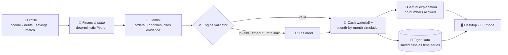
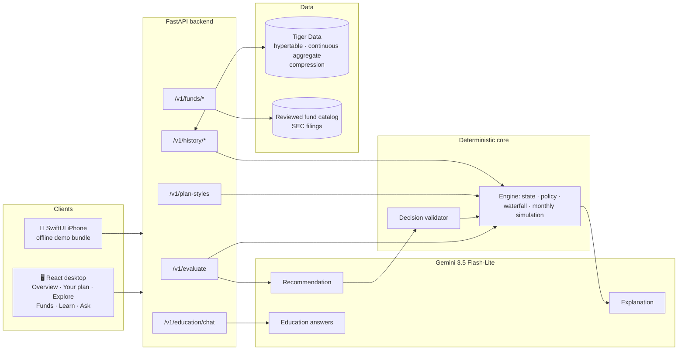

<div align="center">


# (ARM) - Adaptive Retirement Management

**Retirement plans built from your real finances, not just your birth year.**


     
<br/>
    

<sub><b>HackUMBC 2026</b> · University of Maryland, Baltimore County</sub>

[Thesis](#-technical-thesis) · [Tracks](#-built-for-these-tracks) · [Results](#-the-result-same-age-different-plan) · [Architecture](#%EF%B8%8F-architecture) · [Gemini](#-gemini-bounded-ai-that-cant-move-money) · [Tiger Data](#-tiger-data-scenario-history-as-time-series) · [Quality](#-engineering-quality) · [Run it](#-quick-start)

</div>

---

## 🧠 Technical thesis

Target-date funds are the default retirement product for millions of savers, and they know exactly one thing about you: **the year you'll retire**. They don't know you have a 25% credit card, one month of savings, or an employer match you're leaving on the table.

Personalizing that with AI is easy to demo and hard to trust. A language model that picks contribution amounts or moves money is a liability in finance. ARM separates the two jobs:

> **AI chooses the order. Python computes every dollar.**



The model can reorder three priorities within documented rules and explain them in plain words. It can't produce a number the user sees: every dollar, date and balance comes from a deterministic, `Decimal`-based engine, and every AI answer is validated or replaced by a labeled rules fallback.

---

## 🏆 Built for these tracks

| Track | What we built for it | Where |
|---|---|---|
| **NextGen Finance Innovation Challenge** (T. Rowe Price) | A real problem (target-date funds ignore cash flow, debt and emergencies) solved with **AI used responsibly**: bounded to ordering, validated by the engine, always labeled, never trusted with a number. Includes an explainable **target-date fund shortlist** built from reviewed SEC filings. | [Thesis](#-technical-thesis), [Guardrails](#%EF%B8%8F-ai-guardrails), [`docs/FUNDS.md`](docs/FUNDS.md) |
| **[MLH] Best Use of Gemini API** | Gemini 3.5 Flash-Lite makes **three structured calls**: the priority decision (schema-constrained evidence keys), the plain-language explanation, and an **education chat**. All three fit inside strict deadlines, with a circuit breaker and labeled fallbacks. | [Gemini section](#-gemini-bounded-ai-that-cant-move-money) |
| **[MLH] Best Use of Tiger Data** | Scenario history as time series. A **hypertable** of projection points, a **continuous aggregate** that gives the chart its yearly values, and **compression** (81% smaller, measured) on immutable projections. Pooled connections, and every stored number is recomputed and verified by the engine before it's saved. | [Tiger Data section](#-tiger-data-scenario-history-as-time-series) |

---

## 🎯 The problem

> [!IMPORTANT]
> **A target-date fund only knows your birth year.** Two 35-year-olds retiring in 2058 get the *same* plan, even if one has six months of savings and the other carries **$18,000 of credit-card debt at 25% APR**.

T. Rowe Price, whose target-date lineup is its largest product line, has publicly said that personalization is the next step for target-date solutions ([research](https://www.troweprice.com/institutional/us/en/insights/articles/2024/q3/make-it-personal-the-next-chapter-for-target-date-solutions-na.html)). **Adaptive Retirement Management (ARM)** is a working prototype of that idea. It answers three questions:

| 💵 Contribute | 🧭 Prioritize | 📈 Project |
|---|---|---|
| What retirement contribution **fits this person's cash flow** after essentials and required debt payments? | Should the **next dollar** go to the employer match, emergency savings, or high-interest debt? | What happens to **debt, cash and retirement assets**, month by month, until retirement? |

The target-date allocation itself **stays unchanged**. Only contributions and cash priorities adapt.

---

## 📊 The result: same age, different plan

Jordan and Morgan are both **35** and plan to retire at **67**. The same fund would treat them identically:

| | 🟢 **Jordan**: financially established | 🟠 **Morgan**: competing priorities |
|---|---|---|
| Salary | $120,000 | $84,000 |
| Emergency savings | **6 months** | **1 month** |
| Debt | $15,000 student loan at 4% | **$18,000 credit card at 25%** |
| **Adaptive plan** | Keep the 10% contribution; surplus to cash | Contribute 5% to keep the full match, **put $963.80/month extra on the card** |

### Morgan: current habits vs. adaptive plan

Computed month by month by the deterministic engine (no AI involved in any number):

| Outcome at age 67 | Current | **Adaptive** | Difference |
|---|---:|---:|---:|
| 💳 Credit card paid off | month 135 (~11 years) | **month 16** | **119 months sooner** |
| 🔥 Total card interest paid | $35,788 | **$3,272** | **$32,516 saved** |
| 🏦 Retirement balance | $1,320,893 | **$1,462,562** | **+$141,669** |
| 🏦 Retirement balance (today's dollars) | $599,382 | **$663,668** | **+$64,286** |
| 🛟 Full 3-month emergency fund | month 9 | month 21 | 12 months later |

> [!NOTE]
> **The tradeoff is shown, not hidden.** Paying the 25% card first means Morgan builds the full emergency fund a year later. The app puts retirement, debt and cash side by side, so a slower cash buffer is visible next to the $32,516 of interest it saves.

---

## ⚙️ What ARM does

| Step | Who | What happens |
|:---:|---|---|
| **1** | 🧮 Python | Computes the take-home cost of contributions, the allocatable budget, emergency months, match capture and high-interest debt |
| **2** | 🤖 Gemini | Orders three priorities (starter reserve, high-APR debt, full reserve) and cites evidence keys for each |
| **3** | ✅ Python | Rejects invalid orders, unknown evidence or numeric claims, and falls back to the rules order |
| **4** | 📐 Python | Funds every dollar through the waterfall and simulates debt, cash and retirement monthly |
| **5** | 💬 Gemini | Writes a plain-language "why this plan" with no numbers; the app shows exact amounts separately |
| **6** | 🐯 Tiger Data | Optionally saves the run as a time series so two plans can be compared over 5, 10 and 20 years |

<details>
<summary><b>📋 The adaptive waterfall (the order money flows each month)</b></summary>

| Step | Priority | Why it matters |
|:---:|---|---|
| **0** | Essentials and required debt minimums | Nothing discretionary is recommended if basics aren't covered |
| **1** | Critical reserve: min($1,000, one month) | Avoids raiding the 401(k) for a small emergency |
| **2** | Employer match | Captures the full match when affordable |
| **3–5** | Starter reserve · high-APR debt (≥10%) · full reserve | The only steps the AI (or the user's **plan style**) may reorder |
| **6** | Retirement saving toward a 15% combined rate | Restores contributions once liquidity and debt are handled |
| **7** | Residual cash | Kept as unassigned surplus |

</details>

---

## 👀 What judges should notice

| Signal | Why it matters |
|---|---|
| **AI never touches a number** | Gemini returns an order and evidence keys through a JSON schema. The engine re-validates it, and any numeric claim in its prose triggers a fallback. Every response is labeled `ai` or `rules_fallback` with a reason. |
| **Stored numbers are proven, not trusted** | Saving a run to Tiger Data sends only its *inputs*. The server re-runs the engine and stores the result only if the recomputed `input_hash` matches what the user saw (`409` otherwise). |
| **Time series used for what they're good at** | Projections are immutable monthly series: a hypertable holds them, a continuous aggregate serves the chart's yearly points, and compression shrinks them 81%. |
| **Frontend and backend can't drift** | A contract test compares 14 API schemas against the desktop types, and sync tests check that the charts sample exactly the engine's yearly points. |
| **Beginners are guided, not flooded** | A five-page Getting started guide, plan styles explained one at a time, a **?** popover beside every key term (whose numbers come from the engine), and a "Why this matters" for each plan section. |
| **Honest about limits** | Styles that make no difference for someone are shown as the same; the AI's override of a chosen style is disclosed; projections are labeled hypothetical. |

---

## 🏗️ Architecture



| Layer | Owns | Key rule |
|---|---|---|
| **Engine** (`backend/app/engine/`) | Financial state, the waterfall, monthly simulation, projections | Integer cents, `Decimal` math, deterministic; `input_hash` pins every result |
| **AI pipeline** (`backend/app/ai/`) | Gemini client, prompts, circuit breaker | One shared 4-second budget; structured output only |
| **Plan styles** (`/v1/plan-styles`) | Each style's own rule order through the engine | No AI call; cached per profile hash |
| **Scenario history** (`backend/app/analytics/`) | Tiger Data persistence and comparisons | Server recomputes before storing; `/v1/evaluate` never depends on the database |
| **Fund shortlist** (`/v1/funds/*`) | Reviewed target-date catalog and ranking | Only reviewed facts are ranked; missing data excludes a fund |
| **Education chat** (`/v1/education/chat`) | Bounded retirement Q&A | No personal data, no numbers, server-owned sources |

---

## 🛡️ AI guardrails

> [!TIP]
> **AI chooses the order. Python computes every dollar.** No trading, no portfolio changes, and no money routed through a language model.

<table>
<tr>
<td width="50%" valign="top">

#### ✅ The AI may
- Order starter reserve, high-APR debt and full reserve
- Cite evidence and name the tradeoff
- Explain the plan and what changed since last time
- Respect an explicit planning preference

</td>
<td width="50%" valign="top">

#### ⛔ The AI may not
- Change essentials, debt minimums or the critical reserve
- Change the match formula, APRs, caps or return assumptions
- Change the investment allocation
- Infer anything from names, age or demographics

</td>
</tr>
</table>

| Safety net | Behavior |
|---|---|
| ⏱️ **4-second budget** | Both AI calls share one deadline, with no retries |
| 🔌 **Circuit breaker** | After repeated timeouts or a rate limit, AI pauses and requests fall back instantly |
| 🏷️ **Honest labels** | Every response says `ai` or `rules_fallback`, with a reason such as `TIMEOUT` or `AI_COOLDOWN` |
| 🔒 **Privacy** | Prompts contain only computed indicators: no names, IDs or account data |

---

## 🤖 Gemini: bounded AI that can't move money

ARM uses **Gemini 3.5 Flash-Lite** (`google-genai`, structured output, `minimal` thinking) for three jobs, each with its own contract:

| Call | Input | Output (schema-enforced) | If it fails |
|---|---|---|---|
| **Recommendation** | Computed indicators only (no names or IDs) and the permitted priority orders | An order of 3 priorities, each with a summary, evidence keys from an enum built per request, and a tradeoff | Engine rules order, labeled `rules_fallback` + reason |
| **Explanation** | Facts the engine computed, as labeled values | `state_summary` + `narrative` prose; rejected if it contains numbers | Deterministic template |
| **Education chat** | The question + up to 4 recent turns; secrets detected and blocked before any call | A ≤900-character answer with no links, dollar amounts or percentages; sources come from the server | Built-in answer, labeled |

**Speed** (live `POST /v1/evaluate` for Jordan, Morgan and Casey on a laptop, 2026-09-26; "both calls" is recommendation + explanation):

| Mode | Median | Slowest | Within the 4-second budget |
|---|---:|---:|---|
| Rules only (AI off) | 0.11 s | 0.13 s | Always; this is also the fallback path |
| **Gemini 3.5 Flash-Lite, `minimal`** | **2.6 s** | **3.1 s** | **Both AI calls finish** ✅ |
| OpenAI GPT-6 Luna, effort `none` | 4.7 s | 5.8 s | AI decision 9/9; AI explanation 2/9 |
| OpenAI GPT-6 Luna, effort `low` | 7.6 s | 8.5 s | Recommendation times out → rules fallback |

Gemini became the default because it's the only option where both calls fit the budget. The free tier rate-limits bursts (about 17 calls in 30 s); the circuit breaker turns that into instant, labeled fallbacks instead of slow errors.

---

## 🐯 Tiger Data: scenario history as time series

Users save a projection run and compare two runs of the same profile over 5, 10 and 20 years. A projection *is* a time series (a balance, cash and debt value for every month until retirement), and saved runs never change, which suits TimescaleDB well.


| Feature | How we use it | Why |
|---|---|---|
| **Hypertable** | `projection_point` partitioned on the integer month (120-month chunks), keyed by run and strategy | Every run, of any length, shares one time dimension |
| **Continuous aggregate** | `projection_yearly`: `time_bucket(12, month)` with `first(value, month)`, real-time mode, refreshed on each save | Yields exactly the points at months 0, 12, 24…, the same values the desktop chart draws (tested row for row) |
| **Compression** | Segmented by `(run_id, strategy)`, ordered by `month`, with a compression policy | Projections are write-once; on our data this measured **1.38 MB → 262 KB (81% smaller)** across 5,887 points |
| **Relational + time series together** | `scenario_run` (provenance, JSON assumptions) joins `projection_point` in one Postgres | Standard SQL for both; `ON DELETE CASCADE` removes a run's points |
| **Connection pool** | 0–4 connections, health-checked, opened lazily | First call about 336 ms, then about 20 ms, instead of a new TLS handshake per request |

**Integrity:** the app never sends numbers to store. It sends the demo profile ID, scenario, decision and `input_hash`. The server re-validates the decision, re-runs the engine, and saves only its own output if the hash matches. Saving is idempotent on `input_hash`. `/v1/evaluate` never touches the database: without `TIGER_DATABASE_URL` the history routes answer `503 HISTORY_DISABLED`, and outages return a retryable `503`.

```sql
-- The demo query: Morgan's saved runs at 5, 10 and 20 years
SELECT r.label, y.projected_on, y.retirement_balance_cents / 100 AS retirement_usd,
       y.cash_cents / 100 AS cash_usd, y.debt_cents / 100 AS debt_usd
FROM arm.projection_yearly y JOIN arm.scenario_run r USING (run_id)
WHERE r.profile_id = 'morgan' AND y.strategy = r.primary_strategy AND y.month IN (60, 120, 240)
ORDER BY y.month, r.created_at;
```

Details, setup and teardown: [`docs/SCENARIO_HISTORY.md`](docs/SCENARIO_HISTORY.md).

---

## 🖥️ Product surface

The React desktop app and the SwiftUI iPhone app use the same API. The desktop is organized so beginners always know where they are:

| Page | Purpose |
|---|---|
| **Getting started** | Five short pages: welcome, how ARM decides (the waterfall), three ideas that matter most, choosing a plan style one at a time, and where to find things |
| **Overview** | Your next step, three at-a-glance tiles that open their section, where you're heading, and a first-steps checklist |
| **Your plan** | An always-visible projection (plan vs. current habits, shaded difference, pin any age, set a goal line and see when you reach it), then one topic per tab, each with its own **Why this matters** |
| **Explore** | Try another retirement age or contribution; tabs for Compare, Timeline and Saved runs (Tiger Data) |
| **Fund shortlist** | Explainable target-date fund ranking from the reviewed catalog, for 401(k) or IRA |
| **Learn** | Six short lessons, each with a **Try** button that applies the idea to your own numbers |
| **Ask** | The Gemini education chat, from any page |

Key terms carry a **?** popover. Where a definition quotes a number (10% APR, $1,000 reserve, 2.5% inflation), it reads the value from the engine's assumptions, so the text can't drift from the logic.

---

## ✅ Engineering quality

| Check | Result |
|---|---|
| Backend tests (`pytest`) | **541 passing**: engine, policy, simulation, AI pipeline, history, plan styles, funds, education, contracts |
| Real Tiger Data tests (opt-in with `TIGER_DATABASE_URL`) | **5/5**: hypertable, continuous aggregate = chart values, compression, delete, pool reuse |
| Desktop tests (`vitest`) | **95 passing**: chart math, **sync tests on real engine output**, a **contract test** (14 API schemas vs. TypeScript types), API client |
| Live tests against a running backend (`ARM_API=...`) | **7/7**, including save and delete through Tiger Data |
| Mutation checks | Deliberate bugs (off-by-one dates, reversed differences, sampling drift, skipped hash check) each fail the suites |

**Performance:** the desktop's first download is 255 KB instead of 1,126 KB (77 KB gzipped): saved results load on demand, and pages are code-split. Plan-style comparisons are cached per profile hash (about 340 ms → 2.5 ms). The rate limiter's memory is bounded even against spoofed client keys.

---

## 🎬 Demo script

1. **Getting started** opens: walk through how ARM decides, then pick **Debt payoff first** for Morgan.
2. **Your plan**: $1.46M at 67 vs. $1.32M on current habits. Drag across the chart, set a **$1M goal line**, and note "N years sooner".
3. Open **Debt → Why this matters**: payoff in month 16 instead of 135, with the interest on both sides.
4. **Explore**: retire two years later, then **Save to history**. Switch to **Saved runs** and compare the two runs, served from Tiger Data.
5. Toggle **Live calculation** off: the app keeps working on saved results, with honest labels.
6. **Ask**: "What is a target-date fund?", answered by Gemini with server-owned sources.

---

## 🚀 Quick start

```bash
# Backend
cd backend
python -m venv .venv && source .venv/bin/activate     # Windows: .venv\Scripts\activate
pip install -r requirements-test.txt
cp .env.example .env        # add GEMINI_API_KEY for live AI; TIGER_DATABASE_URL for scenario history
uvicorn app.main:app --port 8000

# Desktop (second terminal)
cd desktop && npm install && npm run dev               # http://localhost:5173
```

```bash
pytest                                  # backend suite
cd ../desktop && npm test               # desktop suite
python -m scripts.seed_history          # optional: seed demo runs into Tiger Data
```

> [!NOTE]
> **No API key? It still works.** Without a key, every response uses the rules fallback and is labeled that way. Without `TIGER_DATABASE_URL`, scenario history is off and everything else works.

<details>
<summary><b>📱 Run the full stack on an iPhone</b></summary>

The app only talks to an HTTPS server, so the laptop's API is published through an ngrok tunnel on a fixed free domain.

1. **Backend:** `uvicorn app.main:app --host 127.0.0.1 --port 8000`, with `GEMINI_API_KEY` in `backend/.env` (git-ignored; never in `.env.example`, which is committed).
2. **Tunnel** (once per machine: `brew install ngrok`, `ngrok config add-authtoken <token>`, claim one free static domain): `ngrok http --url=your-team.ngrok-free.dev 8000`. `scripts/serve_demo.sh your-team.ngrok-free.dev` runs the API, the tunnel and `caffeinate` together.
3. **Smoke test** from `backend/`: `python scripts/smoke.py https://your-team.ngrok-free.dev` (expect `RESULT: OK`).
4. **Install:** open `ios/AdaptiveRetirement.xcodeproj`, then `cp ios/Config/Signing.local.xcconfig.example ios/Config/Signing.local.xcconfig` and set `DEVELOPMENT_TEAM` and `BUNDLE_ID_SUFFIX` there (git-ignored), rather than editing Signing & Capabilities. Press ⌘R and enable Developer Mode on the phone.
5. **Point the app at the server:** set `SERVER_BASE_URL` in the same local xcconfig, or at run time via **Explore → Modeling assumptions → Live calculation**.
6. **Check:** live shows **Live calculation** and Morgan's **$963.80** card payment. Offline (Airplane Mode), the committed bundle shows **Saved demo calculation**.

Full runbook: [`docs/RUNBOOK.md`](docs/RUNBOOK.md).

</details>

<details>
<summary><b>🔌 API surface</b></summary>

| Endpoint | Purpose |
|---|---|
| `GET /health` | Status, versions, `ai_available`, Plaid flag |
| `GET /v1/demo-profiles` | The three synthetic profiles |
| `POST /v1/evaluate` | Profile + optional scenario → state, plan, decision, explanation, projections |
| `POST /v1/plan-styles` | Each plan style's own rule order through the engine (no AI), with yearly values and milestones |
| `GET /v1/history/status` · `POST /v1/history/runs` · `GET /v1/history/runs` · `DELETE /v1/history/runs/{id}` · `GET /v1/history/compare` | Scenario history on Tiger Data |
| `GET /v1/funds/catalog` · `POST /v1/funds/shortlist` | Reviewed target-date fund catalog and shortlist |
| `POST /v1/education/chat` | Bounded retirement Q&A |
| `POST /v1/plaid/*` | Stretch goal; returns `503 PLAID_DISABLED` |

Money is integer USD cents; rates are decimals (`0.05` = 5%). The full schema is in [`contracts/openapi.json`](contracts/openapi.json), regenerated from the app and checked by tests, with real example payloads in [`contracts/examples/`](contracts/examples/).

</details>

<details>
<summary><b>🗂️ Repository map</b></summary>

```text
backend/
  app/
    main.py, api.py, schemas.py      API entry, routes and the shared contract
    engine/                          state, policy, waterfall, monthly simulation, evaluator
    ai/                              Gemini/OpenAI clients, prompts, pipeline, circuit breaker
    plan_styles.py                   plan-style comparison (no AI, cached)
    analytics/                       scenario history on Tiger Data
    funds.py, fund_catalog.py        fund ranking and reviewed catalog
    education.py                     education chat
  scripts/                           contracts export, smoke test, demo export, seed history
  tests/                             541 tests
contracts/                           OpenAPI + example payloads (the desktop/iOS contract)
desktop/                             React + Vite desktop app, Vitest suite
ios/                                 SwiftUI iPhone app with the offline demo bundle
docs/                                specifications, handoffs and runbook
```

</details>

<details>
<summary><b>🧰 Tech stack</b></summary>

| Layer | Technology |
|---|---|
| Desktop app | React 18, TypeScript, Vite, SVG charts, Vitest |
| iPhone app | Swift, SwiftUI, Swift Charts, iOS 17+ |
| Backend | Python 3.12, FastAPI, Pydantic, Uvicorn |
| Financial engine | Pure Python, `Decimal` cents, deterministic monthly simulation |
| AI | Gemini 3.5 Flash-Lite via `google-genai` (default), OpenAI optional; structured output, backend only |
| Time-series data | Tiger Data (TimescaleDB): hypertable, continuous aggregate, compression; `psycopg` 3 + `psycopg-pool` |
| Hosting | A teammate's laptop + ngrok tunnel on a fixed free domain |

</details>

---

## 📚 Docs

| File | What it covers |
|---|---|
| [`docs/BACKEND.md`](docs/BACKEND.md) | Full backend and financial-engine specification |
| [`docs/ENGINE_HANDOFF.md`](docs/ENGINE_HANDOFF.md) | Who owns which part of the engine, and the function contracts between them |
| [`docs/SCENARIO_HISTORY.md`](docs/SCENARIO_HISTORY.md) | Scenario history on Tiger Data |
| [`docs/DESKTOP.md`](docs/DESKTOP.md) | React desktop app |
| [`docs/FRONTEND.md`](docs/FRONTEND.md) | iOS app specification |
| [`docs/IOS_INTEGRATION.md`](docs/IOS_INTEGRATION.md) | iOS data layer and backend wiring |
| [`docs/FUNDS.md`](docs/FUNDS.md) | Target-date fund shortlist and its reviewed catalog |
| [`docs/EDUCATION_CHAT.md`](docs/EDUCATION_CHAT.md) | Education chat: grounding, privacy and fallbacks |
| [`docs/RUNBOOK.md`](docs/RUNBOOK.md) | Running, tunneling, checking and recovering the demo server |

---

## 🆚 Why this beats a standard target-date default

| Standard target-date fund | ARM |
|---|---|
| ❌ Uses age only | ✅ Uses cash flow, debt, APRs, savings and employer match |
| ❌ Same plan for everyone born the same year | ✅ Same allocation, **personal contributions and cash priorities** |
| ❌ Silent about debt and emergencies | ✅ Orders emergency savings, high-APR debt and retirement saving |
| ❌ No explanation | ✅ Shows the decision, evidence, tradeoffs and what changed |
| ❌ One projection | ✅ Current vs. adaptive vs. custom, across debt, cash and retirement, saved and compared over time |

## 🧭 Scope and limitations

- **Synthetic data only.** Morgan, Jordan and Casey are fictional; scenario history accepts only the demo profiles, so no personal data reaches the cloud.
- **Illustrative projections.** Steady nominal returns (stocks 6%, bonds 3%), no volatility or withdrawals; results are labeled hypothetical.
- **The fund's mix never changes.** ARM adapts contributions and cash priorities, not the target-date allocation.
- **Out of scope by design:** readiness scores, success probabilities, trading, tax optimization and real bank credentials. Plaid Sandbox is a stretch goal.
- **Open question:** the live AI may reorder priorities away from a user's chosen plan style (the style is its default). The app discloses this when it happens; locking the order would be a small contract change.

---

<div align="center">

**Adaptive Retirement Management (ARM): a target-date plan that understands more than your retirement date.**

<sub>Educational prototype using synthetic data. Morgan, Jordan and Casey are fictional. Not affiliated with or endorsed by T. Rowe Price.</sub>

</div>
