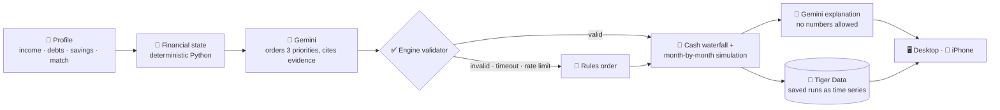
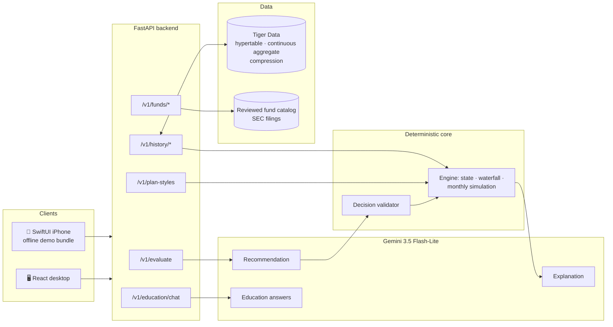
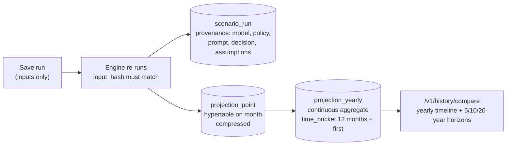

<div align="center">


# (ARM) - Adaptive Retirement Management

**Use your target-date fund well, with a plan built around your finances.**


     
<br/>
  

<sub><b>HackUMBC 2026</b> · University of Maryland, Baltimore County</sub>

[Idea](#-the-idea) · [Result](#-the-result-same-age-different-plan) · [Thesis](#-technical-thesis) · [Architecture](#%EF%B8%8F-architecture) · [Results by track](#-results-by-track) · [Demo](#-demo-script) · [Impact](#-impact) · [Run it](#-run-it)

</div>

---

## 💡 The idea

> [!IMPORTANT]
> **A target-date fund adjusts its investments over time, but it cannot see your cash flow.** Two 35-year-olds using the same 2060 fund may need different contribution, debt and emergency-cash plans.

T. Rowe Price, whose target-date lineup is its largest product line, has said publicly that personalization is the next step for target-date solutions ([research](https://www.troweprice.com/institutional/us/en/insights/articles/2024/q3/make-it-personal-the-next-chapter-for-target-date-solutions-na.html)). **ARM is a working prototype of that idea.** You identify one target-date fund and confirm its balance. ARM uses its reviewed fee and documented glide path where available, then adapts the choices the fund cannot make for you:

- **How much to contribute:** a rate that fits this person's cash flow after essentials and required debt payments.
- **Where the next dollar goes:** the employer match, emergency savings, or high-interest debt, in an order that fits their situation.

Then it projects debt, cash and the fund balance **month by month** until retirement, and shows the tradeoffs openly. AI may order the priorities; the engine validates that order and computes every amount. An expandable comparison shows what the default rules would have done with the same inputs.

---

## 📊 The result: same age, different plan

| | 🟢 **Jordan**: financially established | 🟠 **Morgan**: competing priorities |
|---|---|---|
| Salary · savings | $120,000 · **6 months** | $84,000 · **1 month** |
| Debt | $15,000 student loan at 4% | **$18,000 credit card at 25%** |
| **ARM's plan** | Keep the 10% contribution; surplus to cash | Keep the full match at 5%; **put $963.80/month extra on the card** |

**Morgan, at age 67:** current habits vs. ARM's plan, computed month by month by the deterministic engine (no AI in any number):

| Outcome | Current habits | **ARM plan** | Difference |
|---|---:|---:|---:|
| 💳 Credit card paid off | month 135 (~11 years) | **month 16** | **119 months sooner** |
| 🔥 Card interest paid | $35,788 | **$3,272** | **$32,516 saved** |
| 🏦 Retirement balance | $1,312,515 | **$1,452,666** | **+$140,151** |
| 🏦 In today's dollars | $595,581 | **$659,177** | **+$63,596** |
| 🛟 Full 3-month emergency fund | month 9 | month 21 | 12 months later |

> [!NOTE]
> **The tradeoff is shown, not hidden.** Paying the 25% card first means Morgan's full emergency fund comes a year later. ARM puts retirement, debt and cash side by side, so a slower cash buffer is visible next to the $32,516 of interest it saves.

---

## 🧠 Technical thesis

Personalizing finance with AI is easy to demo and hard to trust. A language model that picks contribution amounts or moves money is a liability. ARM gives the model **one narrow job** and wraps it in deterministic code:

> **AI chooses the order. Python computes every dollar.**



Every dollar, date and balance the user sees comes from a `Decimal`-based engine whose inputs are pinned by an `input_hash`. The model may reorder three priorities within documented rules and explain them in words; everything it returns is validated, or replaced by a **labeled** rules fallback.

### The pipeline, stage by stage

| Stage | Who | What happens |
|---|---|---|
| `derive_state` | 🧮 Python | Take-home cost of contributions, allocatable budget, emergency months, match capture, high-interest debt |
| `recommend` | 🤖 Gemini | Orders starter reserve, high-APR debt and full reserve; each with a summary, evidence keys (an enum built per request) and a tradeoff |
| `validate_decision` | ✅ Python | Rejects invalid orders, unknown evidence or numeric claims → falls back to the rules order, with a reason code |
| `evaluate` | 📐 Python | Funds every dollar through the waterfall and simulates debt, cash and retirement each month for three strategies: current, adaptive, custom |
| `explain` | 💬 Gemini | A plain-language "why this plan" with no numbers; rejected text falls back to a template |
| `save_run` *(optional)* | 🐯 Tiger Data | Server re-runs the engine, checks `input_hash`, stores the projection as a time series |

<details>
<summary><b>📋 The waterfall: the order money flows each month</b></summary>

| Step | Priority | Why it matters |
|:---:|---|---|
| **0** | Essentials and required debt minimums | Nothing discretionary is recommended if basics aren't covered |
| **1** | Critical reserve: min($1,000, one month) | Avoids raiding the 401(k) for a small emergency |
| **2** | Employer match | Captures the full match when affordable |
| **3–5** | Starter reserve · high-APR debt (≥10%) · full reserve | **The only steps the AI, or the user's plan style, may reorder** |
| **6** | Retirement saving toward a 15% combined rate | Restores contributions once liquidity and debt are handled |
| **7** | Residual cash | Yours to spend or save |

</details>

---

## 🏗️ Architecture



- **Engine** (`backend/app/engine/`): integer cents, `Decimal` math, deterministic. The single source of every number.
- **AI pipeline** (`backend/app/ai/`): the Gemini client, prompts and circuit breaker. One shared 4-second budget; structured output only.
- **Plan styles** (`/v1/plan-styles`): each style's own rule order through the engine, with no AI call, cached per profile hash.
- **Scenario history** (`backend/app/analytics/`): Tiger Data persistence. `/v1/evaluate` never depends on the database.
- **Fund shortlist** (`/v1/funds/*`): ranks only reviewed facts; missing data excludes a fund rather than being filled in.
- **Education chat** (`/v1/education/chat`): bounded Q&A. No personal data, no figures, server-owned sources.

---

## 🏆 Results by track

### 1. NextGen Finance Innovation Challenge (T. Rowe Price)

> *"Identify a real financial problem and show how one or more of these technologies* [ETFs, AI, digital assets] *could be used to solve it responsibly."*

**The problem:** target-date funds adjust investments by time to retirement, while contribution and cash choices still depend on debt, reserves, income and employer match. **Our answer:** personalize those choices around one confirmed fund and make the AI decision comparable to default rules.

| What "responsibly" means in ARM | Evidence |
|---|---|
| AI never produces a number | Every figure comes from the engine; numeric claims in AI text trigger a fallback |
| Every decision is explainable | Order, evidence keys, tradeoffs and constraint checks are returned with each plan and shown under **Why this plan?** |
| Every decision is honest about its source | Each response is labeled `ai` or `rules_fallback`, with a reason (`TIMEOUT`, `AI_COOLDOWN`, …) |
| No demographic inference | Prompts contain only computed indicators: no names, IDs or account data |
| Products stay grounded in filings | The catalog covers 6 target-date share classes. Selected funds bring a dated fee and documented glide path into projections; records without numeric glide paths use a labeled fallback. |
| Measurable user outcome | Morgan: **$32,516** less interest, card cleared **119 months sooner**, **+$140,151** at 67 |

### 2. [MLH] Best Use of Gemini API

Gemini 3.5 Flash-Lite (`google-genai`, structured output, `minimal` thinking) does three jobs, each with its own contract:

<table>
<tr>
<td width="50%" valign="top">

#### ✅ Gemini may
- Order starter reserve, high-APR debt and full reserve
- Cite evidence and name the tradeoff
- Explain the plan and what changed since last time
- Answer retirement questions in plain words

</td>
<td width="50%" valign="top">

#### ⛔ Gemini may not
- Change essentials, debt minimums or the critical reserve
- Change the match, APRs, caps or return assumptions
- Change the investment allocation
- Infer anything from names, age or demographics

</td>
</tr>
</table>

| Call | Gemini returns | If it fails or misbehaves |
|---|---|---|
| **Decision** | An order of 3 priorities with evidence keys from a per-request enum | Engine rules order, labeled `rules_fallback` + reason |
| **Explanation** | `state_summary` + `narrative` prose | Deterministic template if the text contains numbers |
| **Education chat** | ≤900 characters; secrets in the question block the call | Built-in answer, labeled; sources come from the server |

**Measured** (live `/v1/evaluate` for Jordan, Morgan and Casey, 2026-09-26; "both calls" = decision + explanation):

| Mode | Median | Slowest | Inside the 4-second budget? |
|---|---:|---:|---|
| Rules only (AI off) | 0.11 s | 0.13 s | Always; this is also the fallback path |
| **Gemini 3.5 Flash-Lite** | **2.6 s** | **3.1 s** | **Both calls finish** ✅ |
| OpenAI GPT-6 Luna, effort `low` | 7.6 s | 8.5 s | Decision times out → rules fallback |

Gemini became the default because it's the only option where both calls fit the budget. A circuit breaker turns free-tier rate limits into instant, labeled fallbacks instead of slow errors.

### 3. [MLH] Best Use of Tiger Data

Users save a plan and compare two plans over 5, 10 and 20 years. A projection is a monthly time series that never changes after it's saved, which suits TimescaleDB well.



| Tiger Data feature | How ARM uses it | Measured |
|---|---|---|
| **Hypertable** | `projection_point`: every monthly balance, cash and debt value, partitioned on the month | 5,887 points across 8 saved runs |
| **Continuous aggregate** | `projection_yearly`: `time_bucket(12, month)` + `first()`, real-time mode, refreshed on save | Matches the desktop chart's yearly points **row for row** (tested) |
| **Compression** | Segmented by `(run_id, strategy)`, ordered by `month`, with a policy | **1.38 MB → 262 KB (81% smaller)** |
| **Relational + time series** | `scenario_run` (provenance, JSON assumptions) and `user_profile` (the user's own numbers, keyed by a hashed anonymous key) join the points in one Postgres | `ON DELETE CASCADE` removes a run cleanly; erasing a profile removes its plans |
| **Connection pool** | 0–4 connections, health-checked, opened lazily | First call about 336 ms, then about **20 ms** |

> [!TIP]
> **Stored numbers are proven, not trusted.** The app sends only a plan's *inputs* (demo profile ID, scenario, decision, `input_hash`). The server re-validates the decision, re-runs the engine, and saves only if the recomputed hash matches what the user saw (`409` otherwise). Saving is idempotent, and `/v1/evaluate` keeps working if the database is down.

<details>
<summary><b>The demo query</b></summary>

```sql
-- Morgan's saved plans at 5, 10 and 20 years
SELECT r.label, y.projected_on, y.retirement_balance_cents / 100 AS retirement_usd,
       y.cash_cents / 100 AS cash_usd, y.debt_cents / 100 AS debt_usd
FROM arm.projection_yearly y JOIN arm.scenario_run r USING (run_id)
WHERE r.profile_id = 'morgan' AND y.strategy = r.primary_strategy AND y.month IN (60, 120, 240)
ORDER BY y.month, r.created_at;
```

</details>

---

## 👀 What judges should notice

- **AI is contained by design, not by prompt alone.** A JSON schema limits what Gemini can say, the engine re-validates it, and a numeric claim in its prose triggers a fallback.
- **Saved numbers are recomputed before they're stored.** Tiger Data holds engine output verified by `input_hash`, never numbers sent from the browser.
- **Frontend and backend can't drift.** A contract test compares 14 API schemas against the desktop types, and sync tests check that the charts sample exactly the engine's yearly points.
- **Beginners are guided, not flooded.** A five-page Getting started guide, a **?** beside every key term (numbers read from the engine), and a **Why this matters** for each section of the plan.
- **Honest about limits.** Styles that make no difference for someone are shown as the same, and an AI override of the chosen style is disclosed on screen.

---

## 🆚 Why not just ask an LLM?

| Asking a chatbot | ARM |
|---|---|
| Invents numbers that sound right | Every number comes from a deterministic engine, and the same inputs always give the same result (`input_hash`) |
| One answer, no alternatives | Current habits vs. adaptive vs. your own scenario, side by side, month by month |
| Can't show its work | Order, evidence, tradeoffs and constraint checks for every decision |
| Fails silently or hallucinates | Validates every answer; falls back to rules with a visible label and reason |
| Forgets the conversation | Plans saved to Tiger Data and compared over 5, 10 and 20 years |

---

## 🎬 Demo script

1. **Getting started** opens → walk through *how ARM decides*, then pick **Debt payoff first** for Morgan.
2. **Your plan** → $1.46M at 67 vs. $1.32M on current habits. Drag the chart, set a **$1M goal line**, read "N years sooner".
3. **Debt → Why this matters** → card cleared in month 16 instead of 135, with interest on both sides.
4. **Explore** → retire two years later → **Save to history** → **Saved runs**: two plans compared from Tiger Data.
5. Turn **Live calculation** off → the app keeps working on saved results, with honest labels.
6. **Ask** → "What is a target-date fund?" → answered by Gemini, with server-owned sources.

---

## 🖥️ The app

| Page | What you do there |
|---|---|
| **Getting started** | Five short pages: welcome, how ARM decides, three ideas that matter most, choose a plan style, where to find things |
| **Overview** | See your next step, three at-a-glance tiles, where you're heading, and a first-steps checklist |
| **Your plan** | An always-visible projection (plan vs. current habits, shaded difference, pin any age, goal line), then one topic per tab, each with **Why this matters** |
| **Explore** | Try another retirement age or contribution; Compare, Timeline and **Saved runs** (Tiger Data: save, compare, delete) |
| **Your numbers** | Enter your own finances; the engine previews what it sees as you type, then builds your plan. Stored in Tiger Data under an anonymous key |
| **Fund shortlist** | Explainable target-date fund ranking for a 401(k) or IRA |
| **Learn** · **Ask** | Six lessons, each with **Try** to apply it to your numbers, and the Gemini education chat |

The iPhone app uses the same API and ships an offline bundle of saved results, so the demo works with no network.

---

## ✅ Engineering quality

- **Backend tests** (`pytest`): engine, policy, simulation, AI pipeline, history, plan styles, funds, education chat, contracts.
- **6/6 real Tiger Data tests**: hypertable, continuous aggregate = chart values, compression, delete, pool reuse, user profiles with private runs (opt-in with `TIGER_DATABASE_URL`).
- **116 desktop tests** (`vitest`): chart math, sync tests on real engine output, the API↔UI contract test (19 schemas), form conversion, the API client.
- **8/8 live tests** against a running server, including save/delete and the full *Your numbers* flow through Tiger Data.
- **Mutation-checked:** deliberate bugs (off-by-one dates, reversed differences, sampling drift, a skipped hash check) each make the suites fail.
- **Performance:** first download 255 KB instead of 1,126 KB; plan-style comparisons cached (about 340 ms → 2.5 ms); rate-limiter memory bounded against spoofed client keys.

---

## 🌍 Impact

<table>
<tr>
<td width="33%" valign="top">

### For savers
A clear **next step each month**, grounded in their real cash flow and selected fund. For a profile like Morgan's, that means **$32,516 less interest**, a card paid off **119 months sooner**, and **+$140,151** at retirement (**+$63,596** in today's dollars), with the tradeoffs visible.

</td>
<td width="33%" valign="top">

### For plan providers
ARM adapts contributions and cash priorities around an existing target-date product. It uses a documented glide path when the catalog has numeric anchors, and records the fund snapshot alongside each saved plan (`input_hash`, catalog, model and policy versions).

</td>
<td width="33%" valign="top">

### For AI in finance
A reusable pattern: **the model proposes, a deterministic engine decides**, and every answer carries its source. It stays useful when the AI is slow, rate-limited or wrong, because the labeled rules path is always there.

</td>
</tr>
</table>

**How we'd measure it in a pilot:** the share of users getting the full employer match, the time to clear high-interest debt, months of emergency savings, and changes in contribution rate, each compared with current-habits projections for the same person.

---

## 🚀 Run it

```bash
# Backend
cd backend
python -m venv .venv && source .venv/bin/activate      # Windows: .venv\Scripts\activate
pip install -r requirements-test.txt
cp .env.example .env     # optional: GEMINI_API_KEY for live AI, TIGER_DATABASE_URL for saved plans
uvicorn app.main:app --port 8000
ngrok http --url=unsheathe-chemicals-truth.ngrok-free.dev 8000

# Desktop (second terminal)
cd desktop && npm install && npm run dev                # http://localhost:5173
```

No keys? It still runs: AI falls back to the labeled rules order, and saved plans are simply off. Tests: `pytest` in `backend/`, `npm test` in `desktop/`.

<details>
<summary><b>📱 iPhone</b></summary>

Publish the API over HTTPS with ngrok (`ngrok http --url=your-team.ngrok-free.dev 8000`, or `scripts/serve_demo.sh`), open `ios/AdaptiveRetirement.xcodeproj`, put your `DEVELOPMENT_TEAM`, `BUNDLE_ID_SUFFIX` and `SERVER_BASE_URL` in the git-ignored `ios/Config/Signing.local.xcconfig`, and press ⌘R. Offline, the app runs on its bundled saved results. Full steps: [`docs/RUNBOOK.md`](docs/RUNBOOK.md).

</details>

<details>
<summary><b>🔌 API</b></summary>

| Endpoint | Purpose |
|---|---|
| `POST /v1/evaluate` | Profile + optional scenario → state, plan, decision, explanation, projections |
| `POST /v1/plan-styles` | Each plan style's rule order through the engine (no AI) |
| `GET /v1/history/status` · `POST/GET /v1/history/runs` · `DELETE /v1/history/runs/{id}` · `GET /v1/history/compare` | Scenario history on Tiger Data |
| `GET /v1/funds/catalog` · `POST /v1/funds/shortlist` | Reviewed fund catalog and shortlist |
| `POST /v1/education/chat` | Bounded retirement Q&A |
| `GET /health` · `GET /v1/demo-profiles` | Status (including `ai_available`) and the three demo profiles |

Money is integer USD cents; rates are decimals. Full schema: [`contracts/openapi.json`](contracts/openapi.json), regenerated from the app and checked by tests.

</details>

<details>
<summary><b>🧰 Stack, repository and docs</b></summary>

| Layer | Technology | Where |
|---|---|---|
| Engine | Python 3.12, `Decimal` cents, deterministic simulation | `backend/app/engine/` |
| API | FastAPI, Pydantic, Uvicorn | `backend/app/` |
| AI | Gemini 3.5 Flash-Lite via `google-genai` (OpenAI optional), structured output | `backend/app/ai/` |
| Time series | Tiger Data / TimescaleDB, `psycopg` 3 + `psycopg-pool` | `backend/app/analytics/` |
| Desktop | React, TypeScript, Vite, Vitest | `desktop/` |
| iPhone | SwiftUI, Swift Charts | `ios/` |

Docs: [fund-aware plan](docs/FUND_AWARE_PLAN.md) · [backend](docs/BACKEND.md) · [engine handoff](docs/ENGINE_HANDOFF.md) · [scenario history](docs/SCENARIO_HISTORY.md) · [desktop](docs/DESKTOP.md) · [funds](docs/FUNDS.md) · [education chat](docs/EDUCATION_CHAT.md) · [runbook](docs/RUNBOOK.md)

</details>

---

## 🧭 Scope and limitations

- **Your own numbers.** Morgan, Jordan and Casey are fictional. Web profiles can be stored in Tiger Data under an anonymous key; iOS also keeps a local copy and stores to Tiger Data when available.
- **Illustrative projections.** Steady nominal returns (stocks 6%, bonds 3%), no volatility or withdrawals, labeled hypothetical.
- **No trades.** ARM models the fund's changing mix and fee, while adapting contributions and cash priorities. It does not alter the fund or execute transactions.
- **Out of scope by design:** readiness scores, success probabilities, trading, tax optimization and real bank credentials. Plaid Sandbox is a stretch goal.

---

<div align="center">

**Adaptive Retirement Management (ARM): a target-date plan that understands more than your retirement date.**

<sub>Educational prototype using synthetic data. Morgan, Jordan and Casey are fictional. Not affiliated with or endorsed by T. Rowe Price.</sub>

</div>
