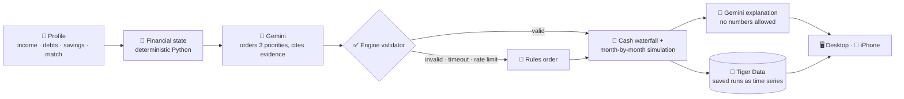
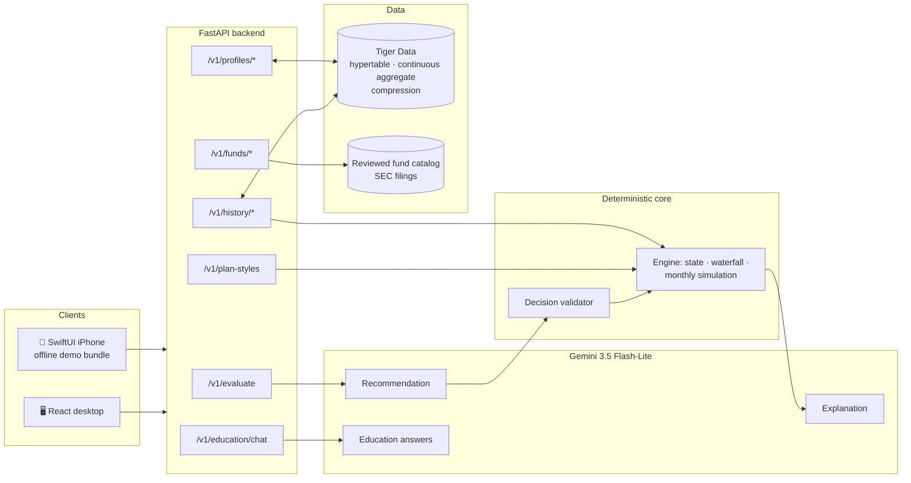
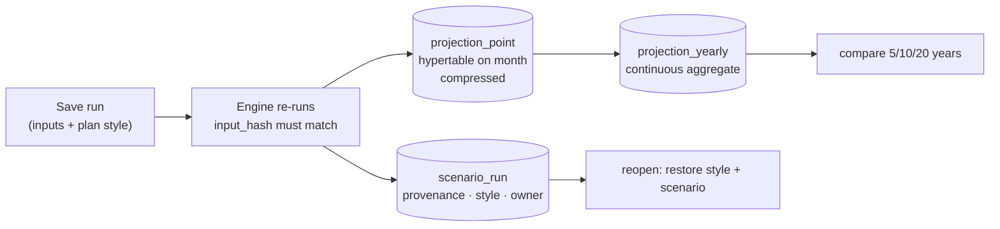

<div align="center">


# (ARM) - Adaptive Retirement Management

**Retirement plans built from your real finances, not just your birth year.**


     
<br/>
    

<sub><b>HackUMBC 2026</b> · University of Maryland, Baltimore County</sub>

[Why ARM](#-why-arm-exists) · [Features](#-features) · [How it works](#-how-it-works) · [Tech stack](#-tech-stack) · [Tracks](#-tracks) · [Results](#-results) · [Obstacles](#-context-and-obstacles) · [Demo](#-demo-script) · [Impact](#-impact) · [Run it](#-run-it)

</div>

---

## 💡 Why ARM exists

> [!IMPORTANT]
> **A target-date fund only knows your birth year.** Two 35-year-olds retiring in 2058 get the *same* plan, even if one has six months of savings and the other carries **$18,000 of credit-card debt at 25% APR**.

T. Rowe Price, whose target-date lineup is its largest product line, has said publicly that personalization is the next step for target-date solutions ([research](https://www.troweprice.com/institutional/us/en/insights/articles/2024/q3/make-it-personal-the-next-chapter-for-target-date-solutions-na.html)). **ARM is a working prototype of that idea.** It keeps the fund's stock/bond mix exactly as it is and adapts the two things the fund ignores: **how much to contribute** (a rate that fits cash flow after essentials and debt minimums) and **where the next dollar goes** (employer match, emergency savings or high-interest debt, in an order that fits the person). It then projects debt, cash and retirement **month by month** and shows every tradeoff.

| Same age, same fund | 🟢 **Jordan**: financially established | 🟠 **Morgan**: competing priorities |
|---|---|---|
| Salary · savings | $120,000 · **6 months** | $84,000 · **1 month** |
| Debt | $15,000 student loan at 4% | **$18,000 credit card at 25%** |
| **ARM's plan** | Keep the 10% contribution; surplus to cash | Keep the full match at 5%; **$963.80/month extra on the card** |

---

## ✨ Features

| Feature | What it does |
|---|---|
| 🧭 **Getting started** | Three skippable pages built from the selected person's live numbers: their snapshot and next step, an interactive walk through this month's money (click a step or **Play the month**), and a tour that lights up each menu item in the real sidebar |
| 🏠 **Overview** | The single most useful next step, three at-a-glance tiles, and a first-steps checklist |
| 📈 **Your plan** | Plan vs. current habits on one chart (drag to any age, shaded difference, goal line with "N years sooner"), then tabs for this month, saving, debt, emergency fund and fund, each with **Why this matters** |
| 🎚️ **Plan style** | Balanced, Cash security first or Debt payoff first: a button beside the plan title and a sidebar menu switch it anytime; a panel compares all three on the person's numbers |
| 🔀 **Explore** | What-if scenarios (retirement age, fixed or adaptive contribution) compared with the plan, plus a five-year timeline |
| 🐯 **Saved runs** | Save any result to Tiger Data; click a run to **reopen it with the same style and scenario** (verified by `input_hash`) or compare two over 5, 10 and 20 years |
| 👥 **Your people** | Up to 10 people with their own finances per browser, stored under an anonymous key, each with private saved runs; the engine previews what it sees as you type |
| 🧾 **Fund shortlist** | A screener over a reviewed catalog: criteria bar, side-by-side table (best value per row), and a card per fund with costs, holdings, score breakdown, returns and SEC sources |
| 📚 **Learn** · 💬 **Ask** | Six lessons, each with **Try** to apply it to your numbers, and a Gemini education chat with server-owned sources |
| 📱 **iPhone** | The same API in SwiftUI, with an offline bundle of saved results so the demo works without a network |

---

## 🧠 How it works

> **AI chooses the order. Python computes every dollar.**

A language model that picks contribution amounts is a liability, so ARM gives Gemini **one narrow job** and wraps it in deterministic code. Every dollar, date and balance comes from a `Decimal` engine in integer cents whose inputs are pinned by an `input_hash`. The model may reorder three priorities within documented rules and explain them in words; everything it returns is validated or replaced by a **labeled** rules fallback.



| Stage | Who | What happens |
|---|---|---|
| `derive_state` | 🧮 Python | Take-home cost of contributions, allocatable budget, emergency months, match capture, high-interest debt |
| `recommend` | 🤖 Gemini | Orders starter reserve, high-APR debt and full reserve; each with a summary, evidence keys (an enum built per request) and a tradeoff |
| `validate_decision` | ✅ Python | Rejects invalid orders, unknown evidence or numeric claims → rules order, with a reason code |
| `evaluate` | 📐 Python | Funds every dollar through the waterfall and simulates debt, cash and retirement monthly for three strategies: current, adaptive, custom |
| `explain` | 💬 Gemini | A plain-language "why this plan" with no numbers; rejected text falls back to a template |
| `save_run` | 🐯 Tiger Data | Server re-runs the engine, checks `input_hash`, stores the projection as a time series with its plan style |

<details>
<summary><b>📋 The waterfall: the order money flows each month</b></summary>

| Step | Priority | Why it matters |
|:---:|---|---|
| **0** | Essentials and required debt minimums | Nothing discretionary is recommended if basics aren't covered |
| **1** | Critical reserve: min($1,000, one month) | Avoids raiding the 401(k) for a small emergency |
| **2** | Employer match | Captures the full match when affordable |
| **3–5** | Starter reserve · high-APR debt (≥10%) · full reserve | **The only steps the AI, or the user's plan style, may reorder** |
| **6** | Retirement saving toward a 15% combined rate | Restores contributions once liquidity and debt are handled |
| **7** | Residual cash | Yours to spend or save |

</details>

<details>
<summary><b>🏗️ Architecture</b></summary>



</details>

---

## 🧰 Tech stack

| Layer | Technology | Where |
|---|---|---|
| Engine | Python 3.12, `Decimal` math in integer cents, deterministic month-by-month simulation | `backend/app/engine/` |
| API | FastAPI, Pydantic v2 (strict models), Uvicorn; OpenAPI contract exported and checked by tests | `backend/app/`, `contracts/` |
| AI | Gemini 3.5 Flash-Lite via `google-genai`, structured output, `minimal` thinking, circuit breaker (OpenAI optional) | `backend/app/ai/` |
| Time series | Tiger Data (TimescaleDB): hypertable, continuous aggregate, compression; `psycopg` 3 + `psycopg-pool` | `backend/app/analytics/` |
| Desktop | React 18, TypeScript, Vite (code-split pages), Vitest | `desktop/` |
| iPhone | SwiftUI, Swift Charts, offline demo bundle | `ios/` |
| Funds data | Reviewed catalog of six Class K target-date funds; every fee, allocation, glide path and return cites its SEC filing and date | `backend/app/data/`, `backend/scripts/` |

---

## 🏆 Tracks

### 1. NextGen Finance Innovation Challenge (T. Rowe Price)

> *"Identify a real financial problem and show how one or more of these technologies* [ETFs, AI, digital assets] *could be used to solve it responsibly."*

**Problem:** target-date funds personalize on age alone. **What we built in that direction:**
- **Personalization around the fund, not inside it:** contribution rate and cash priorities adapt to income, debt, savings and match; the fund's allocation and glide path are never touched.
- **Responsible AI by construction:** AI never produces a number; every decision carries its order, evidence keys, tradeoffs, constraint checks and source (`ai` or `rules_fallback` + reason), shown under **Why this plan?**
- **No demographic inference:** prompts contain only computed indicators, never names, IDs or account data.
- **User choice over the tradeoff:** three plan styles, compared honestly (styles that make no difference are shown as the same; an AI override of the chosen style is disclosed).
- **Grounded products:** a fund shortlist over 6 target-date share classes (BlackRock LifePath Index, State Street Target Retirement) where every fee and allocation cites its SEC filing and missing data excludes a fund instead of being estimated.
- **Built for beginners:** an interactive Getting started, a **?** on every key term, and **Why this matters** on every section.

### 2. [MLH] Best Use of Gemini API

Gemini 3.5 Flash-Lite does three jobs, each with its own contract:

| Call | Gemini returns | Guardrail | If it fails or misbehaves |
|---|---|---|---|
| **Decision** | An order of 3 priorities, evidence keys, tradeoffs | JSON schema with a per-request evidence enum; engine re-validates | Rules order, labeled `rules_fallback` + reason |
| **Explanation** | `state_summary` + `narrative` prose | Numeric claims and certainty words rejected | Deterministic template |
| **Education chat** | ≤900 characters, sources chosen by the server | No personal data or figures; secrets in the question block the call | Built-in answer, labeled |

Gemini may reorder starter reserve, high-APR debt and full reserve, cite evidence and explain; it may **not** change essentials, minimums, the match, APRs, caps, return assumptions or the investment allocation. One shared 4-second budget covers both plan calls, and a circuit breaker turns free-tier rate limits into instant labeled fallbacks.

### 3. [MLH] Best Use of Tiger Data

A projection is a monthly time series that never changes after it's saved, which suits TimescaleDB. **What we built on it:**



- **Hypertable** `projection_point`: every monthly retirement, cash and debt value, partitioned on the integer month.
- **Continuous aggregate** `projection_yearly`: `time_bucket(12, month)` + `first()`, real-time mode, refreshed on save; it feeds the 5/10/20-year comparison.
- **Compression** segmented by `(run_id, strategy)`, ordered by `month`, with a policy; reads and deletes work on compressed chunks.
- **Relational + time series in one Postgres:** `scenario_run` (model, prompt, policy versions, decision, assumptions, **plan style**), `user_profiles` (people's own numbers under a hashed anonymous key) and the points, joined with `ON DELETE CASCADE`.
- **Proven, not trusted:** the app sends only a result's inputs; the server re-runs the engine and stores it only if the recomputed `input_hash` matches (`409` otherwise). Reopening a run re-evaluates and checks the hash again.

<details>
<summary><b>The demo query</b></summary>

```sql
-- Morgan's saved plans at 5, 10 and 20 years
SELECT r.label, r.planning_preference, y.projected_on, y.retirement_balance_cents / 100 AS retirement_usd,
       y.cash_cents / 100 AS cash_usd, y.debt_cents / 100 AS debt_usd
FROM arm.projection_yearly y JOIN arm.scenario_run r USING (run_id)
WHERE r.profile_id = 'morgan' AND y.strategy = r.primary_strategy AND y.month IN (60, 120, 240)
ORDER BY y.month, r.created_at;
```

</details>

---

## 📊 Results

**Morgan at 67, current habits vs. ARM's plan** (deterministic engine, no AI in any number):

| Outcome | Current habits | **ARM plan** | Difference |
|---|---:|---:|---:|
| 💳 Credit card paid off | month 135 (~11 years) | **month 16** | **119 months sooner** |
| 🔥 Card interest paid | $35,788 | **$3,272** | **$32,516 saved** |
| 🏦 Retirement balance | $1,320,893 | **$1,462,562** | **+$141,669** |
| 🏦 In today's dollars | $599,382 | **$663,668** | **+$64,286** |
| 🛟 Full 3-month emergency fund | month 9 | month 21 | 12 months later: the tradeoff, shown not hidden |

<table>
<tr>
<td width="50%" valign="top">

**🤖 AI latency** (live `/v1/evaluate`, both calls)

| Mode | Median | Slowest |
|---|---:|---:|
| Rules only | 0.11 s | 0.13 s |
| **Gemini 3.5 Flash-Lite** | **2.6 s** | **3.1 s** ✅ |
| OpenAI GPT-6 Luna (`low`) | 7.6 s | 8.5 s ❌ |

</td>
<td width="50%" valign="top">

**🐯 Tiger Data** (live service)

| Measure | Value |
|---|---:|
| Compression, 5,887 points | **1.38 MB → 262 KB (−81%)** |
| Yearly aggregate vs. chart | **row-for-row match** |
| Pooled query after first call | **~20 ms** (first ~336 ms) |

</td>
</tr>
</table>

**Engineering quality**

| Check | Result |
|---|---|
| Backend (`pytest`) | **567 passed**: engine, policy, simulation, AI pipeline, history, people, plan styles, funds, chat, contracts |
| Real Tiger Data (opt-in) | **6/6**: hypertable, aggregate = chart values, compression, delete, pool reuse, people with private runs |
| Desktop (`vitest`) | **172 passed**: chart math, the monthly budget adding up to the cent on 12 engine results, restoring saved runs, fund helpers, API↔UI contract (20 schemas) |
| Live API | **13/13**: adaptive scenarios, reopening a saved run to the same `input_hash`, fund scores = weighted parts, several people end to end |
| Mutation checks | Deliberate bugs (off-by-one dates, reversed differences, sampling drift, a skipped hash check) each fail the suites |
| Performance | First download **249 KB** (from 1,126 KB); plan-style comparisons cached **~340 ms → 2.5 ms** |

---

## 🧗 Context and obstacles

Four of us built ARM in 24 hours as three clients (React desktop, SwiftUI iPhone, a shared FastAPI backend), splitting the engine, API/AI pipeline, simulation and iOS app across parallel branches. What got in the way, and what we did about it:

| Obstacle | What happened | What we did |
|---|---|---|
| **AI too slow, or not there at all** | At first neither demo server produced AI decisions; the OpenAI option then needed 7.6 s median against a 4 s budget | Benchmarked providers and made Gemini 3.5 Flash-Lite the default (2.6 s), one shared budget, a circuit breaker for free-tier 429s, `ai_available` in `/health` |
| **AI prose sneaking in numbers** | Explanations quoted amounts the engine never produced; strict filters also rejected harmless phrases | Per-request evidence enum, numeric-claim validator, logged rejections; tuned certainty rules so "a certain buffer" passes |
| **Frontend and backend drifting** | A "high-interest debt cleared" label was really the all-debts date; "This month" didn't add up because take-home excludes the current 401(k) | API↔UI contract test; budget identity proven on 12 engine results; labels derived from API fields |
| **Trusting saved numbers** | Storing numbers sent by a browser would let anything be saved | Store inputs only, recompute server-side, require the same `input_hash` |
| **Time series details** | The yearly aggregate had to match chart sampling exactly; aggregate refresh can't run inside a transaction; pool creation deadlocked on a lock | `first()` in 12-month buckets tested row for row; refresh after commit; pool created outside the lock |
| **Silent test gaps** | After tests stopped reading `.env` (so they can't touch a real database by accident), real-database tests skipped quietly | Explicit opt-in via `TIGER_DATABASE_URL`; the seed script loads `.env` itself |
| **One user per browser** | Testers couldn't add a second person; the sidebar couldn't scroll | `user_profiles` keyed by (owner hash, id), up to 10 people, one-time migration, scrollable list |
| **Two demo servers** | The iPhone hit an ngrok tunnel running a different config: "Couldn't calculate this scenario" | One runbook and health check; tunnel errors made retryable with a saved-result fallback |
| **A leaked key** | An API key reached a committed example file | Revoked and rotated it; every commit's staged diff is now scanned for secrets |
| **Merging four branches** | Parallel work collided in the same UI files | Merge `main` before every task, resolve toward both authors' intent, run every suite before committing |

---

## 🎬 Demo script

1. **Getting started** opens → Morgan's snapshot → **Play the month** to watch each dollar land → tour the menu (items light up in the sidebar).
2. **Your plan** → $1.46M at 67 vs. $1.32M on current habits. Drag the chart, set a **$1M goal line**, read "N years sooner". Click **Plan style** → pick **Debt payoff first**.
3. **Debt → Why this matters** → card cleared in month 16 instead of 135, with interest on both sides.
4. **Explore** → retire two years later → **Save run** → **Saved runs** → click it to reopen with the same choices, or compare two from Tiger Data.
5. **Fund shortlist** → change risk tolerance → read the side-by-side table and a fund's score breakdown.
6. Turn **Live calculation** off → the app keeps working on saved results, with honest labels. **Ask** → "What is a target-date fund?"

---

## 🌍 Impact

<table>
<tr>
<td width="33%" valign="top">

### For savers
A clear **next step each month**, grounded in real cash flow. For a profile like Morgan's: **$32,516 less interest**, a card paid off **119 months sooner**, and **+$141,669** at retirement, with the tradeoffs visible.

</td>
<td width="33%" valign="top">

### For plan providers
Personalization **without touching the fund**: contributions and cash priorities adapt around an existing target-date product. Every decision is explainable and every stored plan auditable (`input_hash`, model and policy versions, plan style).

</td>
<td width="33%" valign="top">

### For AI in finance
A reusable pattern: **the model proposes, a deterministic engine decides**, and every answer carries its source. It stays useful when the AI is slow, rate-limited or wrong.

</td>
</tr>
</table>

**How we'd measure it in a pilot:** share of users getting the full match, time to clear high-interest debt, months of emergency savings, and contribution-rate changes, each against the same person's current-habits projection.

---

## 🚀 Run it

```bash
# Backend
cd backend
python -m venv .venv && source .venv/bin/activate      # Windows: .venv\Scripts\activate
pip install -r requirements-test.txt
cp .env.example .env     # optional: GEMINI_API_KEY for live AI, TIGER_DATABASE_URL for saved plans and people
uvicorn app.main:app --port 8000

# Desktop (second terminal)
cd desktop && npm install && npm run dev                # http://localhost:5173
```

No keys? It still runs: AI falls back to the labeled rules order, and saved runs and people are simply off. Tests: `pytest` in `backend/`, `npm test` in `desktop/` (add `ARM_API=http://127.0.0.1:8000` for live tests, `TIGER_DATABASE_URL` for real-database tests).

<details>
<summary><b>📱 iPhone</b></summary>

Publish the API over HTTPS with ngrok (`ngrok http --url=your-team.ngrok-free.dev 8000`, or `scripts/serve_demo.sh`), open `ios/AdaptiveRetirement.xcodeproj`, put your `DEVELOPMENT_TEAM`, `BUNDLE_ID_SUFFIX` and `SERVER_BASE_URL` in the git-ignored `ios/Config/Signing.local.xcconfig`, and press ⌘R. Offline, the app runs on its bundled saved results. Full steps: [`docs/RUNBOOK.md`](docs/RUNBOOK.md).

</details>

<details>
<summary><b>🔌 API</b></summary>

| Endpoint | Purpose |
|---|---|
| `POST /v1/evaluate` | Profile + optional scenario → state, plan, decision, explanation, projections |
| `POST /v1/plan-styles` | Each plan style's rule order through the engine (no AI) |
| `GET /v1/history/status` · `POST/GET /v1/history/runs` · `DELETE /v1/history/runs/{id}` · `GET /v1/history/compare` | Saved runs on Tiger Data (runs record their plan style) |
| `POST /v1/profiles/build` · `GET/POST /v1/profiles` · `GET/PUT/DELETE /v1/profiles/{id}` | People's own numbers under an anonymous `X-Profile-Key` (server stores only its SHA-256) |
| `GET /v1/funds/catalog` · `POST /v1/funds/shortlist` | Reviewed fund catalog and shortlist |
| `POST /v1/education/chat` | Bounded retirement Q&A |
| `GET /health` · `GET /v1/demo-profiles` | Status (including `ai_available`) and the three demo profiles |

Money is integer USD cents; rates are decimals. Full schema: [`contracts/openapi.json`](contracts/openapi.json), regenerated from the app and checked by tests. Docs: [backend](docs/BACKEND.md) · [engine](docs/ENGINE_HANDOFF.md) · [saved runs](docs/SCENARIO_HISTORY.md) · [desktop](docs/DESKTOP.md) · [funds](docs/FUNDS.md) · [chat](docs/EDUCATION_CHAT.md) · [runbook](docs/RUNBOOK.md)

</details>

---

## 🧭 Scope and limitations

- **Your own numbers, stored anonymously.** Morgan, Jordan and Casey are fictional. People entered by users are stored under a random browser key (the server keeps only its hash), with no account, and can be erased with one click.
- **Illustrative projections.** Steady nominal returns (stocks 6%, bonds 3%), no volatility or withdrawals, labeled hypothetical.
- **The fund's mix never changes.** ARM adapts contributions and cash priorities, not the target-date allocation.
- **Out of scope by design:** readiness scores, success probabilities, trading, tax optimization and real bank credentials.

---

<div align="center">

**Adaptive Retirement Management (ARM): a target-date plan that understands more than your retirement date.**

<sub>Educational prototype using synthetic data. Morgan, Jordan and Casey are fictional. Not affiliated with or endorsed by T. Rowe Price.</sub>

</div>
