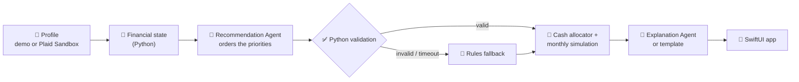

<div align="center">


# (ARM) - Adaptive Retirement Management

**Retirement plans built from your real finances, not just your birth year.**



        

<sub><b>HackUMBC 2026</b> · University of Maryland, Baltimore County</sub>

[The problem](#-the-problem) · [Results](#-the-result-same-age-different-plan) · [How it works](#%EF%B8%8F-how-it-works) · [AI guardrails](#%EF%B8%8F-ai-guardrails) · [Status](#-project-status) · [Run it](#-quick-start)

</div>

---

## 🎯 The problem

> [!IMPORTANT]
> **A target-date fund only knows your birth year.** Two 35-year-olds retiring in 2058 get the *same* plan, even if one has six months of savings and the other carries **$18,000 of credit-card debt at 25% APR**.

T. Rowe Price, whose target-date lineup is its largest product line, has publicly said that personalization is the next step for target-date solutions ([research](https://www.troweprice.com/institutional/us/en/insights/articles/2024/q3/make-it-personal-the-next-chapter-for-target-date-solutions-na.html)). **Adaptive Retirement Management (ARM)** is a working prototype of that idea:

<table>
<tr>
<td width="33%" valign="top">

### 💵 Contribute
What retirement contribution **fits this person's cash flow** after essentials and required debt payments?

</td>
<td width="33%" valign="top">

### 🧭 Prioritize
Should the **next dollar** go to the employer match, emergency savings, or high-interest debt?

</td>
<td width="33%" valign="top">

### 📈 Project
What happens to **debt, cash and retirement assets**, month by month, until retirement?

</td>
</tr>
</table>

The target-date allocation itself **stays unchanged**. Only contributions and cash priorities adapt.

---

## 📊 The result: same age, different plan

Jordan and Morgan are both **35** and plan to retire at **67**. The same fund would treat them the same way:

| | 🟢 **Jordan**: financially established | 🟠 **Morgan**: competing priorities |
|---|---|---|
| Salary | $120,000 | $84,000 |
| Emergency savings | **6 months** | **1 month** |
| Debt | $15,000 student loan at 4% | **$18,000 credit card at 25%** |
| **Adaptive plan** | Keep the 10% contribution; surplus to cash | Contribute 5% to keep the full match, **put $963.80/month extra on the card** |

### Morgan: Current habits vs. Adaptive plan

Computed month by month by the deterministic engine (no AI involved in any number):

| Outcome at age 67 | Current | **Adaptive** | Difference |
|---|---:|---:|---:|
| 💳 Credit card paid off | month 135 (~11 years) | **month 16** | **119 months sooner** |
| 🔥 Total card interest paid | $35,788 | **$3,272** | **$32,516 saved** |
| 🏦 Retirement balance | $1,320,893 | **$1,462,562** | **+$141,669** |
| 🏦 Retirement balance (today's dollars) | $599,382 | **$663,668** | **+$64,286** |
| 🛟 Full 3-month emergency fund | month 9 | month 21 | 12 months later |

> [!NOTE]
> **The tradeoff is shown, not hidden.** Paying the 25% card first means Morgan builds the full emergency fund a year later. The app puts retirement, debt and cash side by side, so a slower cash buffer is visible next to the $32,516 of interest it saves.

---

## ⚙️ How it works



| Step | Who | What happens |
|:---:|---|---|
| **1** | 🧮 Python | Computes take-home cost of contributions, the allocatable budget, emergency months, match capture and high-interest debt |
| **2** | 🤖 Recommendation Agent | Orders three priorities (starter reserve, high-APR debt, full reserve) and cites evidence for each |
| **3** | ✅ Python | Rejects invalid orders, unknown evidence or numeric claims, and falls back to the rules order |
| **4** | 📐 Python | Funds every dollar through the waterfall and simulates debt, cash and retirement monthly |
| **5** | 💬 Explanation Agent | Writes a plain-language "why this plan" with no numbers; the app shows exact amounts separately |

<details>
<summary><b>📋 The adaptive waterfall (click to expand)</b></summary>

| Step | Priority | Why it matters |
|:---:|---|---|
| **0** | Essentials and required debt minimums | Nothing discretionary is recommended if basics aren't covered |
| **1** | Critical reserve: min($1,000, one month) | Avoids raiding the 401(k) for a small emergency |
| **2** | Employer match | Captures the full match when affordable |
| **3–5** | Starter reserve · high-APR debt (≥10%) · full reserve | The only steps the AI may reorder |
| **6** | Retirement saving toward a 15% combined rate | Restores contributions once liquidity and debt are handled |
| **7** | Residual cash | Kept as unassigned surplus |

</details>

---

## 🛡️ AI guardrails

> [!TIP]
> **AI chooses the order. Python computes every dollar.** No trading, no portfolio changes, and no money routed through a language model.

<table>
<tr>
<td width="50%" valign="top">

#### ✅ The AI may
- Order starter reserve, high-APR debt and full reserve
- Cite evidence and name the tradeoff
- Explain the plan and what changed since last time
- Respect an explicit planning preference

</td>
<td width="50%" valign="top">

#### ⛔ The AI may not
- Change essentials, debt minimums or the critical reserve
- Change the match formula, APRs, caps or return assumptions
- Change the investment allocation
- Infer anything from names, age or demographics

</td>
</tr>
</table>

| Safety net | Behavior |
|---|---|
| ⏱️ **4-second budget** | Both AI calls share one deadline, with no retries |
| 🔌 **Circuit breaker** | After repeated timeouts or a rate limit, AI pauses and requests fall back instantly |
| 🏷️ **Honest labels** | Every response says `ai` or `rules_fallback`, with a reason such as `TIMEOUT` or `AI_COOLDOWN` |
| 🔒 **Privacy** | Prompts contain only computed indicators: no names, IDs or account data |

### ⚡ Speed

Live `POST /v1/evaluate` calls for Jordan, Morgan and Casey on a laptop, 2026-09-26. "Both AI calls" is the recommendation plus the explanation.

| Mode | Median | Slowest | Result within the 4-second budget |
|---|---:|---:|---|
| Rules only (AI off) | 0.11 s | 0.13 s | Always; this is also the fallback path |
| Gemini 3.5 Flash-Lite, `minimal` thinking | 2.6 s | 3.1 s | Both AI calls finish ✅; free-tier rate limit hit after about 17 calls in 30 s |
| OpenAI GPT-6 Luna, effort `none` | 4.7 s | 5.8 s | AI decision 9/9; AI explanation 2/9 (the rest use the template) |
| OpenAI GPT-6 Luna, effort `low` | 7.6 s | 8.5 s | Recommendation times out → rules fallback, then AI cooldown |

The OpenAI rows were timed with the budget raised to 20 s so every call could finish; the last column is what the real 4-second budget produces. Every response stays labeled `ai`, `template` or `rules_fallback`.

---

## 🚦 Project status

| Area | Status | Owner |
|---|---|---|
| API, contracts, AI pipeline (OpenAI or Gemini) | ✅ Done | Developer A |
| Financial state, policy, validation | ✅ Done | Developer B |
| Monthly simulation and evaluator | ✅ Done | Developer C |
| Saved AI decisions and offline demo bundle | ✅ Done (committed in the iOS app) | Developer C |
| SwiftUI iPhone app | 🟡 In progress | Frontend |
| Plaid Sandbox import | ⚪ Stretch goal | Developer A |

**Out of scope by design:** readiness scores, success probabilities, allocation changes based on debt, trading, tax optimization and real bank credentials.

---

## 🚀 Quick start

```bash
cd backend
python -m venv .venv
source .venv/bin/activate          # Windows: .venv\Scripts\activate
pip install -r requirements-test.txt
cp .env.example .env               # optional: add GEMINI_API_KEY (or OPENAI_API_KEY) for live AI
uvicorn app.main:app --port 8000
```

```bash
python scripts/smoke.py            # checks health, profiles, evaluations and errors
pytest                             # 341 backend tests
```

> [!NOTE]
> **No API key? It still works.** Without a key for the selected `AI_PROVIDER`, every response uses the rules fallback and is labeled that way. The phone reaches the laptop through an ngrok tunnel (below); see also [`backend/RUNBOOK.md`](backend/RUNBOOK.md).

### 📱 Run the full stack on an iPhone

The app only talks to an HTTPS server, so the laptop's API is published through an ngrok tunnel on a fixed free domain.

**1. Backend (terminal 1)**

```bash
cd backend && source .venv/bin/activate
uvicorn app.main:app --host 127.0.0.1 --port 8000   # log: "AI enabled (provider=gemini, model=gemini-3.5-flash-lite)"
```

For live AI, put `GEMINI_API_KEY=...` in `backend/.env` (git-ignored; never in `.env.example`, which is committed).

**2. Tunnel (terminal 2, once per machine: `brew install ngrok`)**

1. Sign up at <https://dashboard.ngrok.com> and run `ngrok config add-authtoken <token>`.
2. Claim one free static domain under **Domains** (e.g. `your-team.ngrok-free.dev`). The team uses **one domain on one host laptop** per event, and the domain is never committed to the repo.
3. Start the tunnel: `ngrok http --url=your-team.ngrok-free.dev 8000`

`scripts/serve_demo.sh your-team.ngrok-free.dev` runs the API, the tunnel and `caffeinate` together.

**3. Smoke test (terminal 3, from `backend`)**

```bash
python scripts/smoke.py https://your-name.ngrok-free.app   # expect RESULT: OK
```

Run it from `backend/`, since the path is relative. If it fails with `CERTIFICATE_VERIFY_FAILED` on a python.org Python, run `"/Applications/Python 3.12/Install Certificates.command"` once.

**4. Install on the iPhone (Xcode)**

1. Connect the phone by cable, tap **Trust This Computer**, and open `ios/AdaptiveRetirement.xcodeproj`.
2. Select the phone as the run destination and press ⌘R once. Then turn on **Settings → Privacy & Security → Developer Mode** on the phone (the switch appears only after Xcode has seen the phone).
3. Sign with your own Apple ID **without touching Xcode's Signing & Capabilities tab** (that would write your values into the shared `project.pbxproj`). Instead:

   ```bash
   cp ios/Config/Signing.local.xcconfig.example ios/Config/Signing.local.xcconfig
   ```

   Set `DEVELOPMENT_TEAM` to your Team ID (**Xcode → Settings → Accounts**) and `BUNDLE_ID_SUFFIX` to something unique like `.yourname`. The file is git-ignored, so it can't be committed. Without it, the app signs with the team defaults in `ios/Config/Signing.xcconfig`.
4. Press ⌘R. With a free Apple ID, trust the profile under **Settings → General → VPN & Device Management**. Free installs expire after 7 days.

**5. Point the app at your server**

- **Build time (demo host):** set `SERVER_BASE_URL = https:/$()/your-team.ngrok-free.dev` in the git-ignored `ios/Config/Signing.local.xcconfig` (see `ios/Config/Server.xcconfig`; the `$()/` keeps `//` from starting a comment). The committed default is **empty**, so a fresh install runs on the bundled saved calculations only.
- **Run time (any phone):** **Explore → Modeling assumptions → Live calculation**, enter `https://your-team.ngrok-free.dev`. The choice is saved on the device and wins over the build-time default.

**6. Check it**

- **Live:** the badge reads **Live calculation**, profile switching works, Morgan shows the **$963.80** extra card payment, **Why?** shows **AI-assisted priorities**, and **Compare scenario** returns. Repeat once on cellular with Wi-Fi off.
- **Offline:** the bundle is committed in `ios/AdaptiveRetirement/Resources/Demo/` (kept in sync with `backend/fixtures/generated/` by a test). Stop the server, turn on Airplane Mode, then force-quit and reopen the app: it shows **Saved demo calculation**, with every profile, preset and the Morgan demonstration.

<details>
<summary><b>🔌 API surface</b></summary>

| Endpoint | Purpose |
|---|---|
| `GET /health` | Status, versions, Plaid flag |
| `GET /v1/demo-profiles` | The three synthetic profiles |
| `POST /v1/evaluate` | Profile + optional scenario → state, plan, decision, explanation, projections |
| `POST /v1/plaid/*` | Stretch goal; returns `503 PLAID_DISABLED` for now |

Money is integer USD cents; rates are decimals (`0.05` = 5%). The full schema is in [`contracts/openapi.json`](contracts/openapi.json), with real example payloads in [`contracts/examples/`](contracts/examples/).

</details>

<details>
<summary><b>🗂️ Repository map</b></summary>

```text
backend/
  app/
    main.py, api.py, schemas.py      API, routes and the shared contract
    ai/                              OpenAI/Gemini clients, prompts, pipeline, circuit breaker
    engine/                          state, policy, simulation, evaluator
    engine_port.py                   the one seam between API and engine
  scripts/                           contracts export, smoke test, demo export
  fixtures/                          Jordan, Morgan, Casey (+ Morgan cash-security)
  tests/                             341 tests
contracts/                           OpenAPI + example payloads for iOS
BACKEND.md · FRONTEND.md             full specifications
```

</details>

<details>
<summary><b>🧰 Tech stack</b></summary>

| Layer | Technology |
|---|---|
| iPhone app | Swift, SwiftUI, Swift Charts, iOS 17+ |
| Backend | Python 3.12, FastAPI, Pydantic, Uvicorn |
| Financial engine | Pure Python, `Decimal` cents, deterministic monthly simulation |
| AI | OpenAI GPT-6 Luna (default) or Gemini 3.5 Flash-Lite via `google-genai`, structured output, backend only |
| Hosting | A teammate's laptop + ngrok tunnel on a fixed free domain |

</details>

---

## 🆚 Why this beats a standard target-date default

| Standard target-date fund | ARM |
|---|---|
| ❌ Uses age only | ✅ Uses cash flow, debt, APRs, savings and employer match |
| ❌ Same plan for everyone born the same year | ✅ Same allocation, **personal contributions and cash priorities** |
| ❌ Silent about debt and emergencies | ✅ Orders emergency savings, high-APR debt and retirement saving |
| ❌ No explanation | ✅ Shows the decision, evidence, tradeoffs and what changed |
| ❌ One projection | ✅ Current vs. adaptive vs. custom, across debt, cash and retirement |

## Open Implementation Items (Neil and Eric)

What's still to build between Developer A (Neil) and Developer C (Eric). Everything else each side asked for is on `main` (see `what_we_needed/`).

**Team decision (resolved):** the default provider is **Gemini 3.5 Flash-Lite** (`AI_PROVIDER=gemini`, `AI_THINKING_LEVEL=minimal`) — per the [⚡ Speed](#-speed) measurements, it is the option where **both** AI calls fit the 4-second budget. OpenAI GPT-6 Luna remains available (`AI_PROVIDER=openai`); with its default effort `low` every recommendation times out, so it only fits with `AI_REASONING_EFFORT=none`, and most explanations then fall back to templates. The budget stays at 4 s: raising it toward 7 s would push tunnel requests past the app's 8-second timeout (REPORT A6). `/health` now reports `ai_available`, and `smoke.py` warns when live AI is off.

### Neil (Developer A)

1. **Put `GEMINI_API_KEY` on the one demo host** (the laptop from the A2 domain decision). The Gemini free tier rate-limits bursts (about 17 calls in 30 s), so avoid hammering it during rehearsal; the rules fallback is labeled and demo-safe.

### Eric (Developer C)

1. ~~Get the bundle into the app~~ **Done:** the twelve files from `backend/fixtures/generated/` are committed in `ios/AdaptiveRetirement/Resources/Demo/`, and `test_ios_bundle_matches_the_generated_export` keeps them in sync.

No human sign-off step (team decision): the saved AI text is demo placeholder content. To change it later, edit `fixtures/decisions.json` or regenerate, then re-export. The exporter still rejects text with numbers, invalid decisions, and stale hashes.

**Order matters:** the model ID and prompt version are part of every saved hash. Changing the provider, model or prompt version after generating means regenerating and re-exporting.

---

<div align="center">

**Adaptive Retirement Management (ARM): a target-date plan that understands more than your retirement date.**

<sub>Educational prototype using synthetic data. Morgan, Jordan and Casey are fictional. Not affiliated with or endorsed by T. Rowe Price.</sub>

</div>
