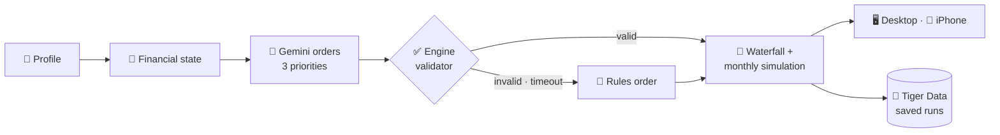

<div align="center">


# (ARM) - Adaptive Retirement Management

**Retirement plans built from your real finances, not just your birth year.**


      

<sub><b>HackUMBC 2026</b> · University of Maryland, Baltimore County</sub>

[Idea](#-the-idea) · [Result](#-the-result) · [How it works](#%EF%B8%8F-how-it-works) · [Tracks](#-tracks) · [Gemini](#-gemini) · [Tiger Data](#-tiger-data) · [Demo](#-demo) · [Run it](#-run-it)

</div>

---

## 💡 The idea

> [!IMPORTANT]
> **A target-date fund only knows your birth year.** Two 35-year-olds retiring in 2058 get the *same* plan, even if one has six months of savings and the other has **$18,000 on a 25% credit card**.

ARM keeps the fund exactly as it is and adapts what it ignores: **how much to contribute** and **where each extra dollar goes** (employer match, emergency savings or expensive debt), then projects debt, cash and retirement month by month.

> **AI chooses the order. Python computes every dollar.**

---

## 📊 The result

Jordan and Morgan are both 35 and retiring at 67. Same fund, very different needs. For Morgan ($84k salary, 1 month saved, $18k card at 25%), the engine's plan keeps the full employer match and puts **$963.80/month extra on the card**:

| At age 67 | Current habits | **ARM plan** |
|---|---:|---:|
| 💳 Card paid off | month 135 | **month 16** (119 months sooner) |
| 🔥 Card interest paid | $35,788 | **$3,272** ($32,516 saved) |
| 🏦 Retirement balance | $1,320,893 | **$1,462,562** (+$141,669) |
| 🛟 Full emergency fund | month 9 | month 21 (the tradeoff, shown openly) |

Every number comes from the deterministic engine; none come from AI.

---

## ⚙️ How it works



1. **Python** computes the financial state: budget, emergency months, match capture, high-interest debt.
2. **Gemini** orders three priorities (cushion, expensive debt, full emergency fund) and cites evidence.
3. **The engine** validates the order, or falls back to the rules order, and labels which one it used.
4. **The engine** funds every dollar through a fixed waterfall and simulates each month to retirement.
5. **Gemini** explains the plan in plain words, with no numbers; the app shows exact amounts separately.

<details>
<summary><b>The waterfall: the order money flows each month</b></summary>

| Step | Priority |
|:---:|---|
| 0 | Essentials and required debt minimums |
| 1 | Critical reserve: min($1,000, one month) |
| 2 | Full employer match |
| 3–5 | Starter reserve · high-APR debt (≥10%) · full reserve (**the only steps the AI or the user's plan style may reorder**) |
| 6 | Retirement saving toward a 15% combined rate |
| 7 | Anything left is yours |

</details>

---

## 🏆 Tracks

| Track | What we built |
|---|---|
| **NextGen Finance** (T. Rowe Price) | A real gap in target-date funds, solved with AI that is **bounded, validated and labeled**, never trusted with a number. Plus an explainable fund shortlist from reviewed SEC filings. |
| **[MLH] Best Use of Gemini API** | Three structured Gemini calls (decision, explanation, education chat), each with a deadline, schema, validator and labeled fallback. |
| **[MLH] Best Use of Tiger Data** | Saved plans as time series: hypertable, continuous aggregate for the charts, and compression (81% smaller, measured). |

---

## 🤖 Gemini

| Call | Gemini returns | Guardrail |
|---|---|---|
| **Decision** | An order of 3 priorities + evidence keys (enum per request) | Engine re-validates; invalid → rules order |
| **Explanation** | Plain-language "why this plan" | Rejected if it contains numbers → template |
| **Education chat** | A short answer to a retirement question | No personal data, links or figures; server-owned sources |

- **Never allowed:** changing essentials, minimums, match, APRs, returns or the fund's mix, or inferring anything from demographics.
- **Always labeled:** every response says `ai` or `rules_fallback`, with the reason (`TIMEOUT`, `AI_COOLDOWN`, …).
- **Fast enough:** both calls fit a shared **4-second budget**, with a median of **2.6 s** (slowest 3.1 s) for Gemini 3.5 Flash-Lite. A circuit breaker turns rate limits into instant, labeled fallbacks.

---

## 🐯 Tiger Data

Users save a plan and compare two plans over 5, 10 and 20 years. A projection is a monthly time series that never changes after it's saved, which suits TimescaleDB well.

| Feature | Our use |
|---|---|
| **Hypertable** | `projection_point`: every monthly balance, cash and debt value, partitioned by month |
| **Continuous aggregate** | `projection_yearly`: the yearly points the charts draw (tested to match row for row) |
| **Compression** | Segmented by run and strategy: **1.38 MB → 262 KB (81% smaller)** |
| **Connection pool** | About 336 ms for the first call, then about **20 ms** |

**Proven, not trusted:** the app sends only a plan's inputs. The server re-runs the engine and stores the result only if its `input_hash` matches what the user saw.

<details>
<summary><b>Demo query</b></summary>

```sql
SELECT r.label, y.projected_on, y.retirement_balance_cents / 100 AS retirement_usd
FROM arm.projection_yearly y JOIN arm.scenario_run r USING (run_id)
WHERE r.profile_id = 'morgan' AND y.strategy = r.primary_strategy AND y.month IN (60, 120, 240)
ORDER BY y.month, r.created_at;
```

</details>

---

## 🖥️ The app

| Page | What you do there |
|---|---|
| **Getting started** | Five short pages that explain ARM and help you pick a plan style |
| **Overview** | See your next step and where you stand |
| **Your plan** | Watch your balance grow; pin any age, set a goal line, open **Why this matters** on each topic |
| **Explore** | Try another retirement age or contribution; save and compare plans (Tiger Data) |
| **Fund shortlist** | Rank target-date funds for a 401(k) or IRA |
| **Learn** · **Ask** | Six short lessons you can apply to your numbers, and a Gemini education chat |

---

## 🎬 Demo

1. **Getting started** → pick **Debt payoff first** for Morgan.
2. **Your plan** → $1.46M at 67 vs. $1.32M on current habits. Set a **$1M goal line** to see "N years sooner".
3. **Debt → Why this matters** → card paid off in month 16 instead of month 135.
4. **Explore** → retire two years later, **Save to history**, then compare in **Saved runs** (Tiger Data).
5. **Ask** → "What is a target-date fund?"

---

## ✅ Quality

| Check | Result |
|---|---|
| Backend (`pytest`) | **541 passing**, plus 5/5 against real Tiger Data |
| Desktop (`vitest`) | **95 passing**, including a contract test that keeps the API and UI types in sync |
| Live, against a running server | **7/7**, including save and delete through Tiger Data |
| First download | **255 KB** (was 1,126 KB) |

---

## 🚀 Run it

```bash
cd backend && python -m venv .venv && source .venv/bin/activate   # Windows: .venv\Scripts\activate
pip install -r requirements-test.txt
cp .env.example .env     # optional: GEMINI_API_KEY for live AI, TIGER_DATABASE_URL for saved plans
uvicorn app.main:app --port 8000

cd ../desktop && npm install && npm run dev    # http://localhost:5173
```

No keys? It still runs: AI falls back to the labeled rules order, and saved plans are simply off.

<details>
<summary><b>📱 iPhone</b></summary>

Publish the API over HTTPS with ngrok (`ngrok http --url=your-team.ngrok-free.dev 8000`, or `scripts/serve_demo.sh`), open `ios/AdaptiveRetirement.xcodeproj`, put your `DEVELOPMENT_TEAM`, `BUNDLE_ID_SUFFIX` and `SERVER_BASE_URL` in the git-ignored `ios/Config/Signing.local.xcconfig`, and press ⌘R. Offline, the app runs on its bundled saved results. Full steps: [`docs/RUNBOOK.md`](docs/RUNBOOK.md).

</details>

<details>
<summary><b>🔌 API</b></summary>

| Endpoint | Purpose |
|---|---|
| `POST /v1/evaluate` | Profile + optional scenario → plan, decision, explanation, projections |
| `POST /v1/plan-styles` | Each plan style's rule order through the engine (no AI) |
| `/v1/history/*` | Save, list, compare and delete plans (Tiger Data) |
| `/v1/funds/*` | Reviewed fund catalog and shortlist |
| `POST /v1/education/chat` | Retirement Q&A |
| `GET /health` · `GET /v1/demo-profiles` | Status and the three demo profiles |

Money is integer cents. Full schema: [`contracts/openapi.json`](contracts/openapi.json).

</details>

<details>
<summary><b>🧰 Stack and repository</b></summary>

| Layer | Technology | Where |
|---|---|---|
| Engine | Python 3.12, `Decimal` cents, deterministic simulation | `backend/app/engine/` |
| API | FastAPI, Pydantic | `backend/app/` |
| AI | Gemini 3.5 Flash-Lite (`google-genai`), structured output | `backend/app/ai/` |
| Time series | Tiger Data / TimescaleDB, `psycopg` + pool | `backend/app/analytics/` |
| Desktop | React, TypeScript, Vite, Vitest | `desktop/` |
| iPhone | SwiftUI, Swift Charts | `ios/` |

Docs: [backend](docs/BACKEND.md) · [scenario history](docs/SCENARIO_HISTORY.md) · [desktop](docs/DESKTOP.md) · [funds](docs/FUNDS.md) · [education chat](docs/EDUCATION_CHAT.md) · [runbook](docs/RUNBOOK.md)

</details>

---

<div align="center">

**ARM: a target-date plan that understands more than your retirement date.**

<sub>Educational prototype with synthetic data. Morgan, Jordan and Casey are fictional. Projections are illustrative, not guarantees. Not affiliated with or endorsed by T. Rowe Price.</sub>

</div>
