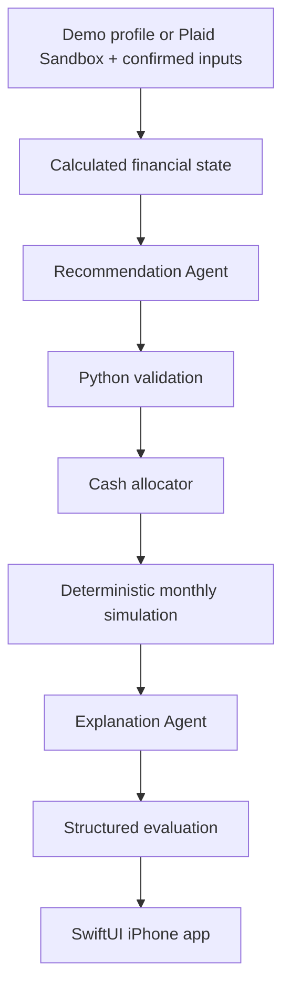
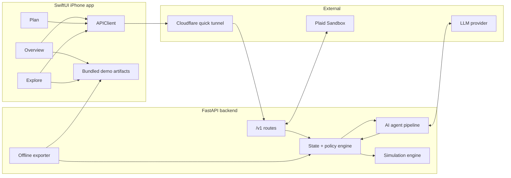
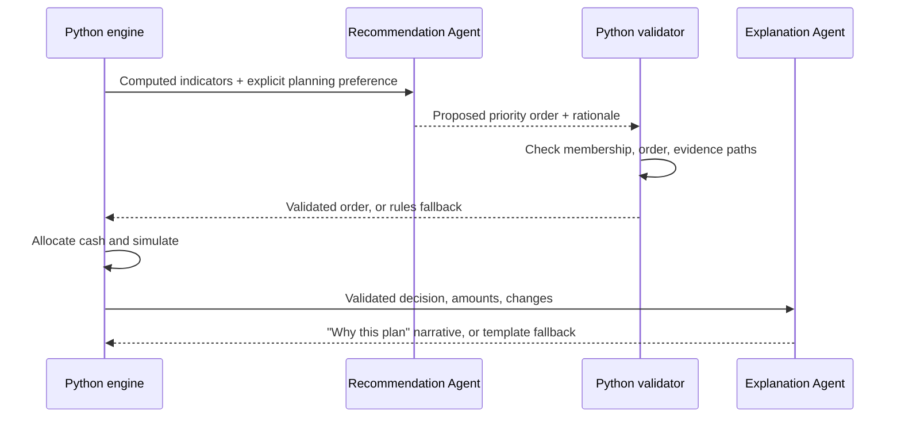

<div align="center">

<!-- LOGO PLACEHOLDER: add the square logo as assets/logo.svg, then uncomment the line below. -->
<!--  -->

### Adaptive Retirement - Target Date Fund 2.0

**A personalization layer for target-date retirement plans: bounded AI agents read a participant's real cash flow, debt, and savings, then Python turns that into an affordable, explainable plan for where every next dollar should go.**


HackUMBC 2026 - University of Maryland, Baltimore County

</div>

---

## Technical Thesis

Target-date funds are not bottlenecked by "can we build a good glide path?"

The harder bottleneck is **personal context**.

Two 35-year-olds retiring in the same year get the same fund, even if one has six months of savings and the other carries $18,000 of 25% APR credit-card debt. Today's default only looks at a birth year. Adaptive Retirement keeps the target-date fund as the investment foundation and personalizes what sits around it: how much to contribute, and where the next dollar should go.



**AI chooses the order of priorities. Python computes every dollar.** No trading, no portfolio optimization, and no money routed through a language model.

---

## Why Adaptive Retirement Exists

When you join a 401(k) and don't pick investments, you are usually defaulted into a target-date fund. It shifts from stocks to bonds as you approach retirement, and the only input it uses is your age.

Real financial lives differ in ways that matter:

- one person has a healthy emergency fund, another has almost nothing,
- one has a low-rate student loan, another has high-interest credit-card debt,
- one captures the full employer match, another is leaving free money on the table,
- one can afford to save more, another is already stretched.

T. Rowe Price, whose target-date lineup is its largest product line, has publicly said that personalization is the logical next step for target-date solutions ([research](https://www.troweprice.com/institutional/us/en/insights/articles/2024/q3/make-it-personal-the-next-chapter-for-target-date-solutions-na.html)). This project is a working, explainable participant experience built around that idea.

The result is a plan that can explain:

```text
what contribution fits this person's cash flow
where the next available dollar should go
why the priorities are ordered the way they are
what happens to debt, cash, and retirement assets over time
what changed since the last plan
```

---

## What Adaptive Retirement Does

It turns a financial profile into a funded plan and a side-by-side projection.


| Step | What happens |
|---|---|
| **Profile intake** | Loads a synthetic demo profile, or imports debts and balances from Plaid Sandbox for the user to confirm. |
| **Financial state** | Python computes take-home cost of contributions, allocatable budget, emergency months, match capture, high-interest debt, and glide-path equity. |
| **Priority selection** | The Recommendation Agent reads the computed liquidity, debt burden, savings capacity, and horizon, then orders starter reserve, high-APR debt, and full reserve with evidence-linked rationale. It cannot compute or overwrite indicators. |
| **Validation** | Python rejects unknown, duplicate, or out-of-order priorities and falls back to a rules order. |
| **Cash allocation** | A monthly waterfall funds every recommendation from one shared budget. |
| **Simulation** | Current, Adaptive, and Custom strategies are projected month by month to retirement. |
| **Explanation** | The Explanation Agent writes "why this plan / why it changed" from validated facts only, with template fallback. |

In short: **Adaptive Retirement is not a robo-advisor. It is an explainable cash-priority layer on top of a target-date fund.**

### The adaptive waterfall

| Step | Priority | Why it matters |
|---|---|---|
| **0** | Essentials and required debt minimums | Nothing discretionary is recommended if basics are not covered. |
| **1** | Critical reserve: min($1,000, one month of expenses) | Avoids raiding the 401(k) for a small emergency. May temporarily outrank the match, disclosed. |
| **2** | Employer match | Captures the match up to the full-match rate when affordable. |
| **3-5** | Starter reserve, high-APR debt (≥10%), full reserve | The only steps AI may reorder, within fixed rules. |
| **6** | Retirement saving toward a 15% combined rate | Restores or raises contributions once liquidity and debt are handled. |
| **7** | Residual cash | Kept as unassigned surplus; no brokerage or IRA optimization. |

---

## What Judges Should Notice

| Signal | Why it is impressive |
|---|---|
| **Same date, different plans** | Jordan and Morgan are both 35 and retire at 67, share the same 90% equity allocation, and get different plans. |
| **Bounded AI** | AI picks among permitted priority orders; Python validates it and computes every amount. |
| **Every dollar is funded** | Recommendations always fit take-home pay; money is conserved to the cent every month. |
| **Explainable decisions** | Every plan section has a "Why?" with the selected order, tradeoffs, evidence, and Python-computed constraint checks. |
| **Honest comparisons** | Retirement balance is shown next to debt interest and liquidity, so a lower balance is not automatically "worse." |
| **Outage-proof demo** | Ten engine-generated artifacts are bundled in the app, so the phone demo works in airplane mode. |

---

## Demo Script

1. Open the app and introduce **same retirement date, different financial lives**.
2. Show **Jordan**: strong reserves, full match, maintain contributions.
3. Switch to **Morgan**: same allocation, preserve the match, accelerate the 25% APR card.
4. Open **Why?** and compare debt, cash, and retirement assets side by side.
5. Run the **retire two years later** preset or a live scenario.
6. Show Morgan's **cash-security** variant: the AI puts the full reserve before extra debt, and the plan shows the debt-interest tradeoff. Explain that Python computes every amount.

The strongest moment is the chain:

```text
same age -> different finances -> different priority order -> funded plan -> projection -> plain-language why
```

---

## Demo Profiles

All profiles are fictional, dated 2026-09-26, with traditional contributions, a 22% estimated tax adjustment, and a 100% match on the first 5% of salary.

| Profile | Age → retire | Salary | Situation | Expected plan |
|---|---|---|---|---|
| **Jordan** | 35 → 67 | $120,000 | 6 months of reserves, 4% student loan | Full match, maintain 10%, surplus to cash |
| **Morgan** | 35 → 67 | $84,000 | 1 month of reserves, $18,000 card at 25% APR | Preserve match at 5%, put $963.80/month extra on the card |
| **Casey** | 58 → 65 | $110,000 | 8 months of reserves, no debt | Full match, maintain 12%, 60.5% equity |

Morgan's opening month, computed by the engine:

| Line | Amount |
|---|---|
| Resources before contribution | $5,236.80 |
| Living expenses | $3,600.00 |
| Debt minimum | $400.00 |
| Adaptive contribution (5%), take-home cost | $273.00 |
| Employer match | $350.00 |
| **Extra debt payment** | **$963.80** |

---

## Product Surface

| Screen | Purpose |
|---|---|
| **Welcome** | Introduces the prototype, the fictional profiles, and the "not affiliated" disclosure. |
| **Overview** | Profile switcher, one primary action, match captured, emergency months, retirement balance. |
| **Plan** | Contributions, monthly cash priorities, debt, emergency savings, and the target-date allocation bar, each with **Why?** |
| **Explore** | Current vs. Adaptive projections, custom retirement age and contribution scenarios, and offline presets. |
| **Sheets** | Financial snapshot with sources and dates, modeling assumptions, connection settings. |

---

## Architecture



The backend runs on a teammate's Mac and reaches the phone through a temporary HTTPS tunnel. The exporter uses the same evaluator as the API, so offline results are never handwritten.

---

## AI Authority

AI is useful where judgment matters, and fenced off where money is computed.



| AI may | AI may not |
|---|---|
| Order starter reserve, high-APR debt, and full reserve | Change essentials, debt minimums, or the critical reserve |
| Cite evidence and tradeoffs | Change the match formula, APRs, caps, or return assumptions |
| Explain the plan and what changed | Change the equity allocation |
| Respect an explicit planning preference | Infer preferences from names or demographics |

There are two single-shot AI calls with structured output, sharing a four-second budget. On timeout, provider failure, or an invalid proposal, the app shows an honest **Rules fallback** label instead of pretending the AI ran.

---

## Tech Stack

| Layer | Technology |
|---|---|
| Frontend | Swift, SwiftUI, Swift Charts, URLSession, iOS 17+ |
| Backend | Python 3.12, FastAPI, Pydantic, Uvicorn |
| Financial engine | Pure Python with `Decimal` cents and deterministic monthly simulation |
| AI | Anthropic or OpenAI Python SDK, two structured single-shot calls, backend only |
| Data | Synthetic fixtures; Plaid Sandbox Liabilities as a stretch |
| Testing | pytest, Swift decoding tests, written device checklist |
| Hosting | A teammate's Mac + Cloudflare quick tunnel |

---

## Repository Map

```text
BACKEND.md                        Backend and financial engine spec
BACKEND_TEAM_SPLIT.md             Backend ownership
FRONTEND.md                       SwiftUI app spec
assets/                           Logo (to be added)

backend/                          (planned)
  app/
    main.py                       FastAPI app
    api.py                        Routes
    schemas.py                    Pydantic contract
    engine/
      state.py                    Derived financial state
      policy.py                   Waterfall, validation, reasons
      simulation.py               Monthly projections
      assumptions.py              Disclosed modeling assumptions
    integrations/plaid.py         Optional Plaid Sandbox adapter
  fixtures/profiles.json          Jordan, Morgan, Casey
  scripts/export_demo.py          Offline artifact exporter
  tests/

contracts/                        OpenAPI + example payloads
ios/AdaptiveRetirement/           SwiftUI app (planned)
```

---

## API Surface

| Endpoint | Purpose |
|---|---|
| `GET /health` | Status, schema/model/policy versions, Plaid flag. |
| `GET /v1/demo-profiles` | The three synthetic profiles. |
| `POST /v1/evaluate` | Profile + optional scenario → state, plan, decision summary, explanation, projections. |
| `POST /v1/plaid/link-token` | Stretch: create a Plaid Link token. |
| `POST /v1/plaid/exchange` | Stretch: exchange the public token for an in-memory session. |
| `POST /v1/plaid/import` | Stretch: import a draft profile with missing fields and warnings. |

Money is integer USD cents. Rates are decimals (`0.05` = 5%).

---

## Local Setup

### 1. Backend

```bash
cd backend
python -m venv .venv
source .venv/bin/activate        # Windows: .venv\Scripts\activate
pip install -r requirements.txt
cp .env.example .env
```

Fill in:

```bash
AI_ENABLED=true
AI_PROVIDER=...
AI_MODEL=...
AI_API_KEY=...
AI_TOTAL_TIMEOUT_SECONDS=4
PLAID_ENABLED=false
```

Without AI credentials, the backend uses its rules fallback.

Run:

```bash
uvicorn app.main:app --host 127.0.0.1 --port 8000
```

Check:

```bash
curl http://localhost:8000/health
```

Test:

```bash
pip install -r requirements-test.txt
pytest
```

### 2. iPhone app

Open `ios/AdaptiveRetirement.xcodeproj` in Xcode, select your development team, and run on a physical iPhone.

---

## Demo Hosting

The phone cannot reach the Mac's `localhost`, so expose the backend with a Cloudflare quick tunnel:

```bash
cloudflared tunnel --url http://localhost:8000
caffeinate -i
```

Enter the printed HTTPS URL in the app's **Connection Settings**. If the tunnel restarts and the URL changes, update it in the app; no rebuild is needed. The bundled offline presets keep the demo working if the tunnel goes down.

---

## Why This Is Different From a Standard Target-Date Fund

| Standard target-date default | Adaptive Retirement |
|---|---|
| Uses age only. | Uses cash flow, debt, APRs, savings, and employer match. |
| Same plan for everyone born the same year. | Same allocation, different contribution and cash priorities. |
| Says nothing about debt or emergency savings. | Orders emergency savings, high-APR debt, and retirement saving. |
| No explanation of why. | Shows the decision, tradeoffs, evidence, and what changed. |
| One projection. | Compares current, adaptive, and custom strategies across debt, cash, and retirement assets. |

---

## Hackathon Scope

MVP:

- Three synthetic profiles with instant switching.
- Adaptive waterfall with employer matching, reserves, and high-APR debt.
- Bounded AI priority ordering with validation and rules fallback.
- AI explanations grounded in validated facts, with template fallback.
- Current vs. Adaptive vs. Custom monthly projections.
- Ten bundled offline artifacts: three presets per profile plus a Morgan cash-security variant.
- Physical-iPhone demo.

Stretch:

- Plaid Sandbox import of debts and balances.
- Seeded Monte Carlo percentiles.

Out of scope:

- Readiness scores, success probabilities, or guaranteed income numbers.
- Allocation changes based on debt or assets.
- Trading, tax optimization, or production bank credentials.

---

*Educational prototype using synthetic or Sandbox data. Morgan, Jordan, and Casey are fictional. Not affiliated with or endorsed by T. Rowe Price.*

<div align="center">

**Adaptive Retirement: a target-date plan that understands more than your retirement date.**

</div>
